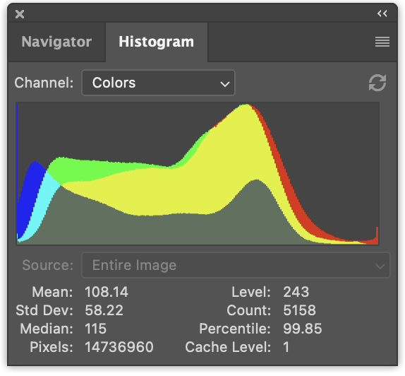

Title: WebGPU Compute Shaders - Image Histogram Part 2
Description: Using an image histogram to adjust video in real time.
TOC: Image Histogram Part 2

In [the previous article](webgpu-compute-shaders-histogram.html) we covered
how to make an image histogram in JavaScript and then converted it to use WebGPU
and went through several steps of optimizing it.

Let's do a few more things with it

## Generate 4 histograms at once.

Given an image like this

<div class="center">
  <div>
    <div></div>
    <div style="text-align: center;"><a href="https://www.pexels.com/photo/cute-kitten-hiding-behind-a-pillow-96938/">Photo by Francesco Ungaro</a></div>
  </div>
</div>

It's common to generate multiple histograms

<div class="webgpu_center side-by-side">
  <div>
    <div></div>
  </div>
  <div>
    <div> </div>
  </div>
</div>

On the left we have 3 histograms, one for red values, one for green, and one for blue. They're drawn
to overlap. On the right we have a luminance histogram like the one we generated in  [the previous article](webgpu-compute-shaders-histogram.html).

It's a tiny change to generate all 4 at once.

In JavaScript, here's the changes to generate 4 histograms at once

```js
function computeHistogram(numBins, imgData) {
  const {width, height, data} = imgData;
-  const bins = new Array(numBins).fill(0);
+  const bins = new Array(numBins * 4).fill(0);
  for (let y = 0; y < height; ++y) {
    for (let x = 0; x < width; ++x) {
      const offset = (y * width + x) * 4;

-      const r = data[offset + 0] / 255;
-      const g = data[offset + 1] / 255;
-      const b = data[offset + 2] / 255;
-      const v = srgbLuminance(r, g, b);
-
-      const bin = Math.min(numBins - 1, v * numBins) | 0;
-      ++bins[bin];

+       for (const ch = 0; ch < 4; ++ch) {
+          const v = ch < 3
+             ? data[offset + ch] / 255
+             : srgbLuminance(data[offset + 0] / 255,
+                             data[offset + 1] / 255,
+                             data[offset + 2] / 255);
+          const bin = Math.min(numBins - 1, v * numBins) | 0;
+          ++bins[bin * 4 + ch];
+       }
    }
  }
  return bins;
}
```

This will generate the histograms interleaved, r, g, b, l, r, g, b, l, r, g, b, l ....

We can update the code to render them like this

```js
function drawHistogram(histogram, numEntries, channels, height = 100) {
-  const numBins = histogram.length;
-  const max = Math.max(...histogram);
-  const scale = Math.max(1 / max);//, 0.2 * numBins / numEntries);
+  // find the highest value for each channel
+  const numBins = histogram.length / 4;
+  const max = [0, 0, 0, 0];
+  histogram.forEach((v, ndx) => {
+    const ch = ndx % 4;
+    max[ch] = Math.max(max[ch], v);
+  });
+  const scale = max.map(max => Math.max(1 / max, 0.2 * numBins / numEntries));

  const canvas = document.createElement('canvas');
  canvas.width = numBins;
  canvas.height = height;
  document.body.appendChild(canvas);
  const ctx = canvas.getContext('2d');

+  const colors = [
+    'rgb(255, 0, 0)',
+    'rgb(0, 255, 0)',
+    'rgb(0, 0, 255)',
+    'rgb(255, 255, 255)',
+  ];

-  ctx.fillStyle = '#fff';
+  ctx.globalCompositeOperation = 'screen';

  for (let x = 0; x < numBins; ++x) {
-    const v = histogram[x] * scale * height;
-    ctx.fillRect(x, height - v, 1, v);
+    const offset = x * 4;
+    for (const ch of channels) {
+      const v = histogram[offset + ch] * scale[ch] * height;
+      ctx.fillStyle = colors[ch];
+      ctx.fillRect(x, height - v, 1, v);
+    }
  }
}
```

And then call that function twice, once to render the
color histograms and once for the luminance histogram

```js
  const histogram = computeHistogram(numBins, imgData);

  showImageBitmap(imgBitmap);

+  // draw the red, green, and blue channels
  const numEntries = imgData.width * imgData.height;
-  drawHistogram(histogram, numEntries);
+ drawHistogram(histogram, numEntries, [0, 1, 2]);
+
+  // draw the luminosity channel
+  drawHistogram(histogram, numEntries, [3]);
```

And now we get these results.

{{{example url="../webgpu-compute-shaders-histogram-4ch-javascript.html"}}}

Doing the same to our WGSL examples is even simpler

For example the our first example that was too slow would
change like this

```wgsl
-@group(0) @binding(0) var<storage, read_write> bins: array<u32>;
+@group(0) @binding(0) var<storage, read_write> bins: array<vec4u>;
@group(0) @binding(1) var ourTexture: texture_2d<f32>;

// from: https://www.w3.org/WAI/GL/wiki/Relative_luminance
const kSRGBLuminanceFactors = vec3f(0.2126, 0.7152, 0.0722);
fn srgbLuminance(color: vec3f) -> f32 {
  return saturate(dot(color, kSRGBLuminanceFactors));
}

@compute @workgroup_size(1, 1, 1) fn cs() {
  let size = textureDimensions(ourTexture, 0);
  let numBins = f32(arrayLength(&bins));
  let lastBinIndex = u32(numBins - 1);
  for (var y = 0u; y < size.y; y++) {
    for (var x = 0u; x < size.x; x++) {
      let position = vec2u(x, y);
-      let color = textureLoad(ourTexture, position, 0);
-      let v = srgbLuminance(color.rgb);
-      let bin = min(u32(v * numBins), lastBinIndex);
-      bins[bin] += 1;
+      var channels = textureLoad(ourTexture, position, 0);
+      channels.w = srgbLuminance(channels.rgb);
+      for (var ch = 0; ch < 4; ch++) {
+        let v = channels[ch];
+        let bin = min(u32(v * numBins), lastBinIndex);
+        bins[bin][ch] += 1;
+      }
    }
  }
}

```

We needed to make room for all 4 channels by changing bins
from `array<u32>` to `array<vec4u>`.

Then we pulled out the color from the texture, computed a
luminance and put it in the `w` element of `channels`

```wgsl
  var channels = textureLoad(ourTexture, position, 0);
  channels.w = srgbLuminance(channels.rgb);
```

This way we could just loop over the 4 channels and increment
the correct bin.

The only other change we need is allocating 4x the memory
for our buffer

```js
  const histogramBuffer = device.createBuffer({
-    size: numBins * 4, // 256 entries * 4 bytes per (u32)
+    size: 256 * 4 * 4, // 256 entries * 4 (rgba) * 4 bytes per (u32)
    usage: GPUBufferUsage.STORAGE | GPUBufferUsage.COPY_SRC,
  });
```

And here's our slow WebGPU version generating 4 histograms

{{{example url="../webgpu-compute-shaders-histogram-4ch-slow.html"}}}

Making similar changes to our fastest version:

```wgsl
const chunkWidth = 256;
const chunkHeight = 1;
const chunkSize = chunkWidth * chunkHeight;
-var<workgroup> bins: array<atomic<u32>, chunkSize>;
-@group(0) @binding(0) var<storage, read_write> chunks: array<array<u32, chunkSize>>;
+var<workgroup> bins: array<array<atomic<u32>, 4>, chunkSize>;
+@group(0) @binding(0) var<storage, read_write> chunks: array<array<vec4u, chunkSize>>;
@group(0) @binding(1) var ourTexture: texture_2d<f32>;

const kSRGBLuminanceFactors = vec3f(0.2126, 0.7152, 0.0722);
fn srgbLuminance(color: vec3f) -> f32 {
  return saturate(dot(color, kSRGBLuminanceFactors));
}

@compute @workgroup_size(chunkWidth, chunkHeight, 1)
fn cs(
  @builtin(workgroup_id) workgroup_id: vec3u,
  @builtin(local_invocation_id) local_invocation_id: vec3u,
) {
  let size = textureDimensions(ourTexture, 0);
  let position = workgroup_id.xy * vec2u(chunkWidth, chunkHeight) + 
                 local_invocation_id.xy;
  if (all(position < size)) {
    let numBins = f32(chunkSize);
    let lastBinIndex = u32(numBins - 1);
-    let color = textureLoad(ourTexture, position, 0);
-    let v = srgbLuminance(color.rgb);
-    let bin = min(u32(v * numBins), lastBinIndex);
-    atomicAdd(&bins[bin], 1u);
+    var channels = textureLoad(ourTexture, position, 0);
+    channels.w = srgbLuminance(channels.rgb);
+    for (var ch = 0; ch < 4; ch++) {
+      let v = channels[ch];
+      let bin = min(u32(v * numBins), lastBinIndex);
+      atomicAdd(&bins[bin][ch], 1u);
+    }
  }

  workgroupBarrier();

  let chunksAcross = (size.x + chunkWidth - 1) / chunkWidth;
  let chunk = workgroup_id.y * chunksAcross + workgroup_id.x;
  let bin = local_invocation_id.y * chunkWidth + local_invocation_id.x;

-  chunks[chunk][bin] = atomicLoad(&bins[bin]);
+  chunks[chunk][bin] = vec4u(
+    atomicLoad(&bins[bin][0]),
+    atomicLoad(&bins[bin][1]),
+    atomicLoad(&bins[bin][2]),
+    atomicLoad(&bins[bin][3]),
+  );
}
```

And for our reduce shader

```wgsl
const chunkWidth = 256;
const chunkHeight = 1;
const chunkSize = chunkWidth * chunkHeight;

struct Uniforms {
  stride: u32,
};

-@group(0) @binding(0) var<storage, read_write> chunks: array<array<u32, chunkSize>>;
+@group(0) @binding(0) var<storage, read_write> chunks: array<array<vec4u, chunkSize>>;
@group(0) @binding(1) var<uniform> uni: Uniforms;

@compute @workgroup_size(chunkSize, 1, 1) fn cs(
  @builtin(local_invocation_id) local_invocation_id: vec3u,
  @builtin(workgroup_id) workgroup_id: vec3u,
) {
  let chunk0 = workgroup_id.x * uni.stride * 2;
  let chunk1 = chunk0 + uni.stride;

  let sum = chunks[chunk0][local_invocation_id.x] +
            chunks[chunk1][local_invocation_id.x];
  chunks[chunk0][local_invocation_id.x] = sum;
}
```

Like the previous example, we need to increase the buffer sizes

```js
  const chunksBuffer = device.createBuffer({
-    size: numChunks * chunkSize * 4,  // 4 bytes per (u32)
+    size: numChunks * chunkSize * 4 * 4,  // 16 bytes per (vec4u)
    usage: GPUBufferUsage.STORAGE | GPUBufferUsage.COPY_SRC,
  });

  const resultBuffer = device.createBuffer({
-    size: chunkSize * 4,
+    size: chunkSize * 4 * 4,
    usage: GPUBufferUsage.COPY_DST | GPUBufferUsage.MAP_READ,
  });
```

That's it.

{{{example url="../webgpu-compute-shaders-histogram-4ch-optimized-more.html"}}}

There were 2 other steps we tried in the previous article.
One used a single workgroup per pixel. Another summed the
chunks with an invocation per bin instead of reducing the bins.

Here's some timing info I got testing these 4 channel versions.

<div class="webgpu_center data-table">
  <div data-diagram="timings4ch"></div>
</div>

You can compare to the 1 channel versions from the previous
article.

<div class="webgpu_center data-table">
  <div data-diagram="timings"></div>
</div>

## Drawing the histogram on the GPU

Let's draw the histogram on the GPU. In JavaScript we used the
canvas 2d API to draw a 1 by height rectangle for each bin which
was very easy. We could do that using WebGPU as well but I think
there's a better approach for the particular issue of drawing a
histogram.

Let's instead just draw a rectangle.
Drawing rectangles we've covered in many places. For example, most of
the examples from [the articles on textures](webgpu-textures.html) use
a rectangle.

For a histogram, in the fragment shader, we could
pass in a texture coordinate and 
convert the horizontal part from 0 -> 1 to 0 -> numBins - 1.
We could then look up the value in that bin and compute a height
in the 0 to 1 range. We could then compare that to our vertical
texture coordinate. If texture coordinate is above
the height then we could draw 0, if it's below the height we'll
could draw some color.

This would work for 1 channel but we'd like to draw multiple channels.
So instead, we'll set a bit, one for each channel that is above the
height and then use those 4 bits to look up one of 16 colors. This
will also let us select the colors we want to represent each channel and their combinations.

Here's a fragment shader that does this

```wgsl
struct Uniforms {
  matrix: mat4x4f,  // <- used by the vertex shader
  colors: array<vec4f, 16>,
  channelMult: vec4u,
};

@group(0) @binding(0) var<storage, read> bins: array<vec4u>;
@group(0) @binding(1) var<uniform> uni: Uniforms;
@group(0) @binding(2) var<storage, read_write> scale: vec4f;

@fragment fn fs(fsInput: OurVertexShaderOutput) -> @location(0) vec4f {
  let numBins = arrayLength(&bins);
  let lastBinIndex = u32(numBins - 1);
  let bin = clamp(
      u32(fsInput.texcoord.x * f32(numBins)),
      0,
      lastBinIndex);
  let heights = vec4f(bins[bin]) * scale;
  let bits = heights > vec4f(fsInput.texcoord.y);
  let ndx = dot(select(vec4u(0), uni.channelMult, bits), vec4u(1));
  return uni.colors[ndx];
}
```

The first part is computing which bin based off the horizontal texture coordinate

```wgsl
  let numBins = arrayLength(&bins);
  let lastBinIndex = u32(numBins - 1);
  let bin = clamp(
      u32(fsInput.texcoord.x * f32(numBins)),
      0,
      lastBinIndex);
```

The next part is getting the heights for all 4 channels.
We're multiplying by `scale` just like we did in
JavaScript. We'll need to supply that later.

```wgsl
  let heights = vec4f(bins[bin]) * scale;
```

Next we set 4 booleans in a `vec4<bool>`,
one for each channel. They'll be true the height of the bin is
higher than the texture coordinate.

```wgsl
    let bits = heights > vec4f(fsInput.texcoord.y);
```

The next part will then select values from `uni.channelMult` based on those 4 bools and then add
the 4 values.
Being able to pass in `uni.channelMult` is the similar to what we did in
the JavaScript, letting us choose which channels get drawn. For example
if we set `channelMult` to `1, 2, 4, 0` then we'll get the red, green,
and blue histograms.

```wgsl
  let ndx = dot(select(vec4u(0), uni.channelMult, bits), vec4u(1));
```

This last part looks up one of our 16 colors.

```wgsl
  return uni.colors[ndx];
```

We also need a shader to compute `scale`. In JavaScript we
did this

```js
  const numBins = histogram.length / 4;
  const max = [0, 0, 0, 0];
  histogram.forEach((v, ndx) => {
    const ch = ndx % 4;
    max[ch] = Math.max(max[ch], v);
  });
  const scale = max.map(max => Math.max(1 / max, 0.2 * numBins / numEntries));
```

To do the same thing in a compute shaders we could do something like this

```wgsl
@group(0) @binding(0) var<storage, read> bins: array<vec4u>;
@group(0) @binding(1) var<storage, read_write> scale: vec4f;
@group(0) @binding(2) var ourTexture: texture_2d<f32>;

@compute @workgroup_size(1, 1, 1) fn cs() {
  let size = textureDimensions(ourTexture, 0);
  let numEntries = f32(size.x * size.y);
  var m = vec4u(0);
  let numBins = arrayLength(&bins);
  for (var i = 0u ; i < numBins; i++) {
    m = max(m, bins[i]);
  }
  scale = max(1.0 / vec4f(m), vec4f(0.2 * f32(numBins) / numEntries));
}
```

Note that the only reason we pass in `ourTexture` is to get its size so
we can compute `numEntries` where as in JavaScript we passed in `numEntries`.
We could also use a uniform to pass in `numEntries` but then we'd have to
create a uniform buffer, update it with the value for `numEntries`, bind
it, etc... It seemed easier to just reference the texture itself.

Another thing to consider is this is another place where we're using only
a single core. We could reduce here too but there are only `numBins` steps
which is only 256. The overhead of dispatching a bunch of reduce steps
would *probably* outweigh the parallelization. I did time it and was told
it was around 0.1ms, at least on one machine.

So, what's left to do is put the parts together

Since we're going to
draw to the canvas with the GPU we need to get the
preferred canvas format

```js
  const presentationFormat = navigator.gpu.getPreferredCanvasFormat();

```

We need to create the shader modules with the 2 shaders above
and create pipelines for each one. 

```js
  const scaleModule = device.createShaderModule({
    label: 'histogram scale shader',
    code: `
      @group(0) @binding(0) var<storage, read> bins: array<vec4u>;
      @group(0) @binding(1) var<storage, read_write> scale: vec4f;
      @group(0) @binding(2) var ourTexture: texture_2d<f32>;

      @compute @workgroup_size(1, 1, 1) fn cs() {
        let size = textureDimensions(ourTexture, 0);
        let numEntries = f32(size.x * size.y);
        var m = vec4u(0);
        let numBins = arrayLength(&bins);
        for (var i = 0u ; i < numBins; i++) {
          m = max(m, bins[i]);
        }
        scale = max(1.0 / vec4f(m), vec4f(0.2 * f32(numBins) / numEntries));
      }
    `,
  });

  const drawHistogramModule = device.createShaderModule({
    label: 'draw histogram shader',
    code: `
      struct OurVertexShaderOutput {
        @builtin(position) position: vec4f,
        @location(0) texcoord: vec2f,
      };

      struct Uniforms {
        matrix: mat4x4f,
        colors: array<vec4f, 16>,
        channelMult: vec4u,
      };

      @group(0) @binding(0) var<storage, read> bins: array<vec4u>;
      @group(0) @binding(1) var<uniform> uni: Uniforms;
      @group(0) @binding(2) var<storage, read_write> scale: vec4f;

      @vertex fn vs(
        @builtin(vertex_index) vertexIndex : u32
      ) -> OurVertexShaderOutput {
        let pos = array(

          vec2f( 0.0,  0.0),  // center
          vec2f( 1.0,  0.0),  // right, center
          vec2f( 0.0,  1.0),  // center, top

          // 2st triangle
          vec2f( 0.0,  1.0),  // center, top
          vec2f( 1.0,  0.0),  // right, center
          vec2f( 1.0,  1.0),  // right, top
        );

        var vsOutput: OurVertexShaderOutput;
        let xy = pos[vertexIndex];
        vsOutput.position = uni.matrix * vec4f(xy, 0.0, 1.0);
        vsOutput.texcoord = xy;
        return vsOutput;
      }

      @fragment fn fs(fsInput: OurVertexShaderOutput) -> @location(0) vec4f {
        let numBins = arrayLength(&bins);
        let lastBinIndex = u32(numBins - 1);
        let bin = clamp(
            u32(fsInput.texcoord.x * f32(numBins)),
            0,
            lastBinIndex);
        let heights = vec4f(bins[bin]) * scale;
        let bits = heights > vec4f(fsInput.texcoord.y);
        let ndx = dot(select(vec4u(0), uni.channelMult, bits), vec4u(1));
        return uni.colors[ndx];
      }
    `,
  });

  const scalePipeline = device.createComputePipeline({
    label: 'scale',
    layout: 'auto',
    compute: {
      module: scaleModule,
      entryPoint: 'cs',
    },
  });

  const drawHistogramPipeline = device.createRenderPipeline({
    label: 'draw histogram',
    layout: 'auto',
    vertex: {
      module: drawHistogramModule,
      entryPoint: 'vs',
    },
    fragment: {
      module: drawHistogramModule,
      entryPoint: 'fs',
      targets: [{ format: presentationFormat }],
    },
  });
```

We no longer need the result buffer since we're not going
to read the values back but we need a scale buffer to
store the scale we're going to compute.

```js
-  const resultBuffer = device.createBuffer({
-    size: chunkSize * 4 * 4,
-    usage: GPUBufferUsage.COPY_DST | GPUBufferUsage.MAP_READ,
-  });
+  const scaleBuffer = device.createBuffer({
+    size: 4 * 4,
+    usage: GPUBufferUsage.STORAGE,
+  });
```

We need a bind group for our scale pipeline that has the chunks,
the scale buffer, and the texture

```js
  const scaleBindGroup = device.createBindGroup({
    layout: scalePipeline.getBindGroupLayout(0),
    entries: [
      {
        binding: 0,
        resource: {
          buffer: chunksBuffer,
          size: chunkSize * 4 * 4,
        },
      },
      { binding: 1, resource: { buffer: scaleBuffer }},
      { binding: 2, resource: texture.createView() },
    ],
  });
```

Above we set the size of the binding for the `chunksBuffer`
to just the size of the first chunk. This way, in the
shader this code

```wgsl
      @group(0) @binding(0) var<storage, read> bins: array<vec4u>;

      ...

        let numBins = arrayLength(&bins);
```

will get the correct value. If we didn't specific the size
then the entire `chunksBuffer` size would be available and
`numBins` would be calculated from all of the chunks, not just
the first one.

Now, after we've reduced the chunks into one chunk we can
run our scale compute shader to compute the scale and,
since we longer have a result buffer we no longer need to copy
the first chunk into it, nor do we need to map the result buffer,
nor do we need to pass `numEntries` since we were using that
to compute a scale but we've already done that. We also
are not going to pass `histogram` which is the data we got
from the result buffer. Our data is already in the `chunksBuffer`.


```js
+  // Compute scales for the channels
+  pass.setPipeline(scalePipeline);
+  pass.setBindGroup(0, scaleBindGroup);
+  pass.dispatchWorkgroups(1);
  pass.end();

-  encoder.copyBufferToBuffer(chunksBuffer, 0, resultBuffer, 0, resultBuffer.size);
  const commandBuffer = encoder.finish();
  device.queue.submit([commandBuffer]);

-  await resultBuffer.mapAsync(GPUMapMode.READ);
-  const histogram = new Uint32Array(resultBuffer.getMappedRange());

  showImageBitmap(imgBitmap);

  // draw the red, green, and blue channels
-  const numEntries = texture.width * texture.height;
-  drawHistogram(histogram, numEntries, [0, 1, 2]);
+  drawHistogram([0, 1, 2]);

  // draw the luminosity channel
-  drawHistogram(histogram, numEntries, [3]);
+  drawHistogram([3]);

-  resultBuffer.unmap();
```

Now we need to update our `drawHistogram` function to render
with the GPU.

First we need to make a uniform buffer to pass our uniforms.
For reference here's the uniforms from the shaders we'll draw
the histogram with

```wgsl
struct Uniforms {
  matrix: mat4x4f,
  colors: array<vec4f, 16>,
  channelMult: vec4u,
};
```

So, here's the code to create a buffer for and fill out the
channelMult and colors.

```js
  function drawHistogram(channels, height = 100) {
    const numBins = chunkSize;

    //  matrix: mat4x4f;
    //  colors: array<vec4f, 16>;
    //  channelMult; vec4u,
    const uniformValuesAsF32 = new Float32Array(16 + 64 + 4 + 4);
    const uniformValuesAsU32 = new Uint32Array(uniformValuesAsF32.buffer);
    const uniformBuffer = device.createBuffer({
      label: 'draw histogram uniform buffer',
      size: uniformValuesAsF32.byteLength,
      usage: GPUBufferUsage.UNIFORM | GPUBufferUsage.COPY_DST,
    });
    const subpart = (view, offset, length) => view.subarray(offset, offset + length);
    const matrix = subpart(uniformValuesAsF32, 0, 16);
    const colors = subpart(uniformValuesAsF32, 16, 64);
    const channelMult = subpart(uniformValuesAsU32, 16 + 64, 4);
    channelMult.set(range(4, i => channels.indexOf(i) >= 0 ? 2 ** i : 0));
    colors.set([
      [0, 0, 0, 1],
      [1, 0, 0, 1],
      [0, 1, 0, 1],
      [1, 1, 0, 1],
      [0, 0, 1, 1],
      [1, 0, 1, 1],
      [0, 1, 1, 1],
      [0.5, 0.5, 0.5, 1],
      [1, 1, 1, 1],
      [1, 1, 1, 1],
      [1, 1, 1, 1],
      [1, 1, 1, 1],
      [1, 1, 1, 1],
      [1, 1, 1, 1],
      [1, 1, 1, 1],
      [1, 1, 1, 1],
    ].flat());
    const range = (i, fn) => new Array(i).fill(0).map((_, i) => fn(i));
    channelMult.set(range(4, i => channels.indexOf(i) >= 0 ? 2 ** i : 0));
```

We also need to compute a matrix using matrix math like we covered
in [the series of articles about matrix math](webgpu-translation.html).

In particular, our shader has a hard coded unit quad that goes
from 0 to 1 in X and Y. If we scale it by 2 in both X and Y and
subtract 1 we'll get a quad that goes from -1 to +1 in both direction that covers clip space. This way of using a single
unit quad is common as then we can just use a little matrix
math to draw rectangles in any position and orientation without
having to make special vertex data.

```js
    mat4.identity(matrix);
    mat4.translate(matrix, [-1, -1, 0], matrix);
    mat4.scale(matrix, [2, 2, 1], matrix);
    device.queue.writeBuffer(uniformBuffer, 0, uniformValuesAsF32);
```

We need a bindGroup for all of this

```js
    const bindGroup = device.createBindGroup({
      layout: drawHistogramPipeline.getBindGroupLayout(0),
      entries: [
        { binding: 0, resource: { buffer: chunksBuffer, size: chunkSize * 4 * 4 }},
        { binding: 1, resource: { buffer: uniformBuffer } },
        { binding: 2, resource: { buffer: scaleBuffer }},
      ],
    });
```

We need a canvas configured for WebGPU

```js
    const canvas = document.createElement('canvas');
    const context = canvas.getContext('webgpu');
    context.configure({
      device,
      format: presentationFormat,
    });
    canvas.width = numBins;
    canvas.height = height;
    document.body.appendChild(canvas);
```

and finally we can render

```js
    // Get the current texture from the canvas context and
    // set it as the texture to render to.
    const renderPassDescriptor = {
      label: 'our basic canvas renderPass',
      colorAttachments: [
        {
          view: context.getCurrentTexture().createView(),
          clearValue: [0.3, 0.3, 0.3, 1],
          loadOp: 'clear',
          storeOp: 'store',
        },
      ],
    };

    const encoder = device.createCommandEncoder({ label: 'render histogram' });
    const pass = encoder.beginRenderPass(renderPassDescriptor);
    pass.setPipeline(drawHistogramPipeline);
    pass.setBindGroup(0, bindGroup);
    pass.draw(6);  // call our vertex shader 6 times
    pass.end();

    const commandBuffer = encoder.finish();
    device.queue.submit([commandBuffer]);
  }
```

And with all of that we're rendering on the GPU

{{{example url="../webgpu-compute-shaders-histogram-4ch-optimized-more-gpu-draw.html"}}}

Let's do one last thing, let's get a histogram of video.
We're effectively going to merge the example from the
[the article on using external video](webgpu-textures-external-video.html) and our previous example.

We need to update our HTML and CSS to match the video example

```html
    <style>
      @import url(resources/webgpu-lesson.css);
+html, body {
+  margin: 0;       /* remove the default margin          */
+  height: 100%;    /* make the html,body fill the page   */
+}
canvas {
+  display: block;  /* make the canvas act like a block   */
+  width: 100%;     /* make the canvas fill its container */
+  height: 100%;
-  max-width: 256px;
-  border: 1px solid #888;
}
+#start {
+  position: fixed;
+  left: 0;
+  top: 0;
+  width: 100%;
+  height: 100%;
+  display: flex;
+  justify-content: center;
+  align-items: center;
+}
+#start>div {
+  font-size: 200px;
+  cursor: pointer;
+}
    </style>
  </head>
  <body>
+    <canvas></canvas>
+    <div id="start">
+      <div>▶️</div>
+    </div>
  </body>
```

We'll setup one canvas right at the beginning

```js
  // Get a WebGPU context from the canvas and configure it
  const canvas = document.querySelector('canvas');
  const context = canvas.getContext('webgpu');
  const presentationFormat = navigator.gpu.getPreferredCanvasFormat();
  context.configure({
    device,
    format: presentationFormat,
  });
```

Because we're using an external texture we need to change
our shaders for that kind of texture. For example the histogram
chunk making shader needs these changes

```wgsl
const chunkSize = chunkWidth * chunkHeight;
var<workgroup> bins: array<array<atomic<u32>, 4>, chunkSize>;
@group(0) @binding(0) var<storage, read_write> chunks: array<array<vec4u, chunkSize>>;
-@group(0) @binding(1) var ourTexture: texture_2d<f32>;
+@group(0) @binding(1) var ourTexture: texture_external;

const kSRGBLuminanceFactors = vec3f(0.2126, 0.7152, 0.0722);
fn srgbLuminance(color: vec3f) -> f32 {
  return saturate(dot(color, kSRGBLuminanceFactors));
}

@compute @workgroup_size(chunkWidth, chunkHeight, 1)
fn cs(
  @builtin(workgroup_id) workgroup_id: vec3u,
  @builtin(local_invocation_id) local_invocation_id: vec3u,
) {
-  let size = textureDimensions(ourTexture, 0);
+  let size = textureDimensions(ourTexture);
  let position = workgroup_id.xy * vec2u(chunkWidth, chunkHeight) + 
                 local_invocation_id.xy;
  if (all(position < size)) {
    let numBins = f32(chunkSize);
    let lastBinIndex = u32(numBins - 1);
-    var channels = textureLoad(ourTexture, position, 0);
+    var channels = textureLoad(ourTexture, position);
    channels.w = srgbLuminance(channels.rgb);
    for (var ch = 0; ch < 4; ch++) {
      let v = channels[ch];
      let bin = min(u32(v * numBins), lastBinIndex);
      atomicAdd(&bins[bin][ch], 1u);
    }
  }

...
```

Our scale calculating shader has similar changes

```wgsl
@group(0) @binding(0) var<storage, read> bins: array<vec4u>;
@group(0) @binding(1) var<storage, read_write> scale: vec4f;
-@group(0) @binding(2) var ourTexture: texture_2d<f32>;
+@group(0) @binding(2) var ourTexture: texture_external;

@compute @workgroup_size(1, 1, 1) fn cs() {
-  let size = textureDimensions(ourTexture, 0);
+  let size = textureDimensions(ourTexture);
  let numEntries = f32(size.x * size.y);

  ...
```

The shader module to draw the video is copied directly from
the video article as is the creation of a render pipeline
to use it and a sampler for the video and a uniform buffer
and render pass to draw with.
We have the same code to wait for a click and start playing
the video.

After the video starts we can setup for computing
a histogram. The only change is we don't get our size from
the texture but instead from the video.

```js
-  const imgBitmap = await loadImageBitmap('resources/images/pexels-francesco-ungaro-96938-mid.jpg');
-  const texture = createTextureFromSource(device, imgBitmap);

-  const chunksAcross = Math.ceil(texture.width / k.chunkWidth);
-  const chunksDown = Math.ceil(texture.height / k.chunkHeight);
+  const chunksAcross = Math.ceil(video.videoWidth / k.chunkWidth);
+  const chunksDown = Math.ceil(vide.videoHeight / k.chunkHeight);
```

We had our code to draw the histograms in `drawHistogram`
but that code created its own canvas and created other things
that were only used once. We'll get rid of `drawHistogram`
and make some code to setup a uniform buffer and bind group
for each of the 2 histograms we want to draw

```js
  const histogramDrawInfos = [
    [0, 1, 2],
    [3],
  ].map(channels => {
    //        matrix: mat4x4f;
    //        colors: array<vec4f, 16>;
    //        channelMult; vec4u,
    const uniformValuesAsF32 = new Float32Array(16 + 64 + 4 + 4);
    const uniformValuesAsU32 = new Uint32Array(uniformValuesAsF32.buffer);
    const uniformBuffer = device.createBuffer({
      label: 'draw histogram uniform buffer',
      size: uniformValuesAsF32.byteLength,
      usage: GPUBufferUsage.UNIFORM | GPUBufferUsage.COPY_DST,
    });
    thingsToDestroy.push(uniformBuffer);
    const subpart = (view, offset, length) => view.subarray(offset, offset + length);
    const matrix = subpart(uniformValuesAsF32, 0, 16);
    const colors = subpart(uniformValuesAsF32, 16, 64);
    const channelMult = subpart(uniformValuesAsU32, 16 + 64, 4);
    colors.set([
      [0, 0, 0, 1],
      [1, 0, 0, 1],
      [0, 1, 0, 1],
      [1, 1, 0, 1],
      [0, 0, 1, 1],
      [1, 0, 1, 1],
      [0, 1, 1, 1],
      [0.5, 0.5, 0.5, 1],
      [1, 1, 1, 1],
      [1, 1, 1, 1],
      [1, 1, 1, 1],
      [1, 1, 1, 1],
      [1, 1, 1, 1],
      [1, 1, 1, 1],
      [1, 1, 1, 1],
      [1, 1, 1, 1],
    ].flat());

    const drawHistogramBindGroup = device.createBindGroup({
      layout: drawHistogramPipeline.getBindGroupLayout(0),
      entries: [
        { binding: 0, resource: { buffer: chunksBuffer, size: chunkSize * 4 * 4 }},
        { binding: 1, resource: { buffer: uniformBuffer } },
        { binding: 2, resource: { buffer: scaleBuffer }},
      ],
    });

    return {
      drawHistogramBindGroup,
      matrix,
      uniformBuffer,
      uniformValuesAsF32,
    };
  });
```

At render time, first we import the video texture. Remember, it's only valid for this one JavaScript event so we have to create
the bind groups that reference the texture every frame

```js
  function render() {
    const texture = device.importExternalTexture({source: video});

    // make a bind group for to make a histogram from this video texture
    const histogramBindGroup = device.createBindGroup({
      layout: histogramChunkPipeline.getBindGroupLayout(0),
      entries: [
        { binding: 0, resource: { buffer: chunksBuffer }},
        { binding: 1, resource: texture },
      ],
    });

    const scaleBindGroup = device.createBindGroup({
      layout: scalePipeline.getBindGroupLayout(0),
      entries: [
        { binding: 0, resource: { buffer: chunksBuffer, size: chunkSize * 4 * 4 }},
        { binding: 1, resource: { buffer: scaleBuffer }},
        { binding: 2, resource: texture },
      ],
    });

    ... insert histogram computing code here ...
```

As for render, rendering the video is similar to the article
about rendering external video. The one difference is the code
that computes a matrix. We're doing the scale by 2, subtract 1
thing like we mentioned above for the histogram but we're using -2
for y and adding 1 so that we flip Y. We're also scaling to
get a [cover effect](https://developer.mozilla.org/en-US/docs/Web/CSS/background-size#cover) so the video always fills the canvas but keeps the correct aspect ratio.

```js
    // Draw to canvas
    {
      const canvasTexture = context.getCurrentTexture().createView();
      renderPassDescriptor.colorAttachments[0].view = canvasTexture;
      const pass = encoder.beginRenderPass(renderPassDescriptor);

      // Draw video
      const bindGroup = device.createBindGroup({
        layout: videoPipeline.getBindGroupLayout(0),
        entries: [
          { binding: 0, resource: videoSampler },
          { binding: 1, resource: texture },
          { binding: 2, resource: { buffer: videoUniformBuffer }},
        ],
      });

      // 'cover' canvas
      const canvasAspect = canvas.clientWidth / canvas.clientHeight;
      const videoAspect = video.videoWidth / video.videoHeight;
      const scale = canvasAspect > videoAspect
         ? [1, canvasAspect / videoAspect, 1]
         : [videoAspect / canvasAspect, 1, 1];

      const matrix = mat4.identity(videoMatrix);
      mat4.scale(matrix, scale, matrix);
      mat4.translate(matrix, [-1, 1, 0], matrix);
      mat4.scale(matrix, [2, -2, 1], matrix);

      device.queue.writeBuffer(videoUniformBuffer, 0, videoUniformValues);

      pass.setPipeline(videoPipeline);
      pass.setBindGroup(0, bindGroup);
      pass.draw(6);  // call our vertex shader 6 times
```

To draw the histograms is just moving up the code from
`drawHistogram`

```js
      // Draw Histograms
      histogramDrawInfos.forEach(({
        matrix,
        uniformBuffer,
        uniformValuesAsF32,
        drawHistogramBindGroup,
      }, i) => {
        mat4.identity(matrix);
        mat4.translate(matrix, [-0.95 + i, -1, 0], matrix);
        mat4.scale(matrix, [0.9, 0.5, 1], matrix);

        device.queue.writeBuffer(uniformBuffer, 0, uniformValuesAsF32);

        pass.setPipeline(drawHistogramPipeline);
        pass.setBindGroup(0, drawHistogramBindGroup);
        pass.draw(6);  // call our vertex shader 6 times
      });

      pass.end();
    }

    const commandBuffer = encoder.finish();
    device.queue.submit([commandBuffer]);

    requestAnimationFrame(render);
  }
  requestAnimationFrame(render);
```

The matrix math above draws a quad on the left or right that is 90%
the width of half of the canvas, centered on that half,
and ¼ of the canvas tall.

{{{example url="../webgpu-compute-shaders-histogram-video.html"}}}

<div class="webgpu_center">
   <div>Video by <a href="https://www.pexels.com/video/timelapse-video-of-the-city-5750980/">Ekaterina Martynova</a>
   </div>
</div>

Ok, so why compute a histogram?
There are several things you can do with a histogram

* show it to the user so they can make informed decisions
  on image adjustments
* apply [histogram equalization](https://www.google.com/search?q=histogram+equalization) to the image
* apply [adaptive histogram equalization](https://www.google.com/search?q=adaptive+histogram+equalization) to the image
* Use it for [image segmentation](https://www.google.com/search?q=histogram+based+image+segmentation)
* Posterize using [histogram thresholding](https://www.google.com/search?q=histogram+thresholding)

And a bunch of other techniques. Maybe we can cover some later.
My hope is these have been useful examples. We went from some JavaScript
that computed a histogram and JavaScript that drew a histogram
to having all the work done on the GPU, including rendering
that is hopefully fast enough to run in real time.

<!-- keep this at the bottom of the article -->
<link rel="stylesheet" href="webgpu-compute-shaders-histogram.css">
<script type="module" src="webgpu-compute-shaders-histogram.js"></script>
