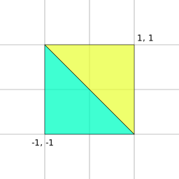
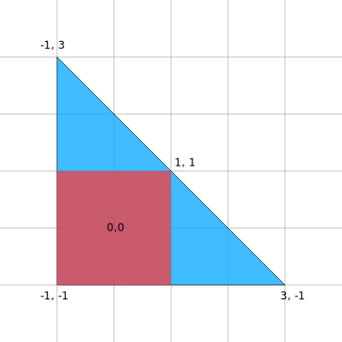

Title: WebGPU Large Triangle to Cover Clip Space
Description: Large Triangle to Cover Clip Space
TOC: Large Clip Space Triangle

This is a small *trick* / *pattern* and it's a minor optimization.

Often you need to draw a full screen, full canvas, full texture quad.
In other words, a rectangle that covers all of clip space.

The most obvious way to do this is to make a quad from 2 triangles

<div class="webgpu_center">
  <div>
    
    <div>clip space quad via 2 triangles</div>
  </div>
</div>


```
    // bottom left triangle
    -1, -1,
     1, -1,
    -1,  1,

    // top right triangle
    -1,  1,
     1, -1,
     1,  1,
```

Whether you do this by passing in data in a vertex shader or hard code
it into the shader it's a common need. We've used this several times.
For example [generating mipmaps in the article on importing textures](webgpu-importing-textures.html).

It works, and it's easy to understand.

There's a shortcut though for this specific case. We can instead
make a single triangle that is large enough that it covers the entire
clip space area. A simple example is this triangle

<div class="webgpu_center">
  <div>
    
    <div>pink = clip space</div>
  </div>
</div>

This is just 3 vertices instead of 6

```
    -1,  3,
     3, -1,
    -1, -1,
```

Because the GPU is going to clip this triangle to clip space we
get the same result as the 6 triangle quad but we save a little
typing.

On top of that though, GPUs generally draw pixels in 2x2 pixel
units. They use this or various reasons but one is to be more efficient.
So, if we draw 2 triangles, down the edges where the 2 triangle meet,
the GPU has to do extra work. It wants to process a 2x2 square but has
to do extra work to only draw the 1 or 2 pixels each triangle actually
needed to draw to.

By drawing the single triangle we avoid this extra work.

The truth is this extra work is tiny. For a full screen quad it
probably uses less than 0.5% of a 60hz frame. It's not nothing
but it's unlikely to be the difference between your app running
smoothly vs slow.

That said, typing 3 vertices is simpler than typing 6 so even
if it is only a tiny performance win it's still a pattern that
feels good to use when appropriate. Examples are anytime you need
to draw a full clip space quad. For example generating mipmaps,
drawing a skybox, doing post processing, making a shader toy,
etc...
