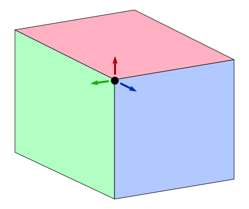
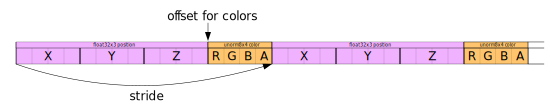

Title: WebGPU Orthographic Projection
Description: Orthographic Projection (no perspective)
TOC: Orthographic Projection

This article is the 5th in a series of articles that will hopefully teach
you about 3D math. Each one builds on the previous lesson so you may find
them easiest to understand by reading them in order.

1. [Translation](webgpu-translation.html)
2. [Rotation](webgpu-rotation.html)
3. [Scaling](webgpu-scale.html)
4. [Matrix Math](webgpu-matrix-math.html)
5. [Orthographic Projection](webgpu-orthographic-projection.html) ⬅ you are here
6. [Perspective Projection](webgpu-perspective-projection.html)
7. [Cameras](webgpu-cameras.html)
8. [Matrix Stacks](webgpu-matrix-stacks.html)
9. [Scene Graphs](webgpu-scene-graphs.html)

In the last post we went over how matrices work. We talked
about how translation, rotation, scaling, and even projecting from
pixels into clip space can all be done by 1 matrix and some magic
matrix math. To do 3D is only a small step from there.

In our previous 2D examples we had 2D points (x, y) that we multiplied by
a 3x3 matrix. To do 3D we need 3D points (x, y, z) and a 4x4 matrix.

Let's take our last example and change it to 3D. We'll use an F again
but this time a 3D 'F'.

The first thing we need to do is change the vertex shader to handle 3D.
Here's the old vertex shader.

```wgsl
struct Uniforms {
  color: vec4f,
-  matrix: mat3x3f,
+  matrix: mat4x4f,
};

struct Vertex {
-  @location(0) position: vec2f,
+  @location(0) position: vec4f,
};

struct VSOutput {
  @builtin(position) position: vec4f,
};

@group(0) @binding(0) var<uniform> uni: Uniforms;

@vertex fn vs(vert: Vertex) -> VSOutput {
  var vsOut: VSOutput;
-
-  let clipSpace = (uni.matrix * vec3f(vert.position, 1)).xy;
-  vsOut.position = vec4f(clipSpace, 0.0, 1.0);
  vsOut.position = uni.matrix * vert.position;
  return vsOut;
}

@fragment fn fs(vsOut: VSOutput) -> @location(0) vec4f {
  return uni.color;
}
```

It got even simpler! Just like in 2D we provided `x` and `y` and then
set `z` to 1, in 3D we will provide `x`, `y`, and `z` and we need `w`
to be 1 but we can take advantage of the fact that for attributes
`w` defaults to 1.

Then we need to provide 3D data.

```js
function createFVertices() {
  const vertexData = new Float32Array([
    // left column
*    0, 0, 0,
*    30, 0, 0,
*    0, 150, 0,
*    30, 150, 0,

    // top rung
*    30, 0, 0,
*    100, 0, 0,
*    30, 30, 0,
*    100, 30, 0,

    // middle rung
*    30, 60, 0,
*    70, 60, 0,
*    30, 90, 0,
*    70, 90, 0,
  ]);

  const indexData = new Uint32Array([
    0,  1,  2,    2,  1,  3,  // left column
    4,  5,  6,    6,  5,  7,  // top run
    8,  9, 10,   10,  9, 11,  // middle run
  ]);

  return {
    vertexData,
    indexData,
    numVertices: indexData.length,
  };
}
```

Above we just added a ` 0,` to the end of each line

```js
  const pipeline = device.createRenderPipeline({
    label: '2 attributes',
    layout: 'auto',
    vertex: {
      module,
      buffers: [
        {
-          arrayStride: (2) * 4, // (2) floats, 4 bytes each
+          arrayStride: (3) * 4, // (3) floats, 4 bytes each
          attributes: [
-            {shaderLocation: 0, offset: 0, format: 'float32x2'},  // position
+            {shaderLocation: 0, offset: 0, format: 'float32x3'},  // position
          ],
        },
      ],
    },
    fragment: {
      module,
      targets: [{ format: presentationFormat }],
    },
  });
```

Next we need to change all the matrix math from 2D to 3D

<div class="webgpu_center compare" style="align-items: end;">
  <div>
    <div class="glocal-center">
      <table class="glocal-center-content glocal-mat">
        <tr>
          <td class="m11">1</td>
          <td class="m12">0</td>
          <td class="m13">tx</td>
        </tr>
        <tr>
          <td class="m21">0</td>
          <td class="m22">1</td>
          <td class="m23">ty</td>
        </tr>
        <tr>
          <td class="m31">0</td>
          <td class="m32">0</td>
          <td class="m33">1</td>
        </tr>
      </table>
    </div>
    <div>2D translation matrix</div>
  </div>
  <div>
    <div class="glocal-center">
      <table class="glocal-center-content glocal-mat">
        <tr>
          <td class="m11">1</td>
          <td class="m12">0</td>
          <td class="m13">0</td>
          <td class="m14">tx</td>
        </tr>
        <tr>
          <td class="m21">0</td>
          <td class="m22">1</td>
          <td class="m23">0</td>
          <td class="m24">ty</td>
        </tr>
        <tr>
          <td class="m31">0</td>
          <td class="m32">0</td>
          <td class="m33">1</td>
          <td class="m34">tz</td>
        </tr>
        <tr>
          <td class="m41">0</td>
          <td class="m42">0</td>
          <td class="m43">0</td>
          <td class="m44">1</td>
        </tr>
      </table>
    </div>
    <div>3D translation matrix</div>
  </div>
</div>

<div class="webgpu_center compare" style="align-items: end;">
  <div>
    <div class="glocal-center">
      <table class="glocal-center-content glocal-mat">
        <tr>
          <td class="m11">c</td>
          <td class="m12">-s</td>
          <td class="m13">0</td>
        </tr>
        <tr>
          <td class="m21">s</td>
          <td class="m22">c</td>
          <td class="m23">0</td>
        </tr>
        <tr>
          <td class="m31">0</td>
          <td class="m32">0</td>
          <td class="m33">1</td>
        </tr>
      </table>
    </div>
    <div>2D rotation matrix</div>
  </div>
  <div>
    <div class="glocal-center">
      <table class="glocal-center-content glocal-mat">
        <tr>
          <td class="m11">c</td>
          <td class="m12">-s</td>
          <td class="m13">0</td>
          <td class="m14">0</td>
        </tr>
        <tr>
          <td class="m21">s</td>
          <td class="m22">c</td>
          <td class="m23">0</td>
          <td class="m24">0</td>
        </tr>
        <tr>
          <td class="m31">0</td>
          <td class="m32">0</td>
          <td class="m33">1</td>
          <td class="m34">0</td>
        </tr>
        <tr>
          <td class="m41">0</td>
          <td class="m42">0</td>
          <td class="m43">0</td>
          <td class="m44">1</td>
        </tr>
      </table>
    </div>
    <div>3D rotation Z matrix</div>
  </div>
</div>

<div class="webgpu_center compare" style="align-items: end;">
  <div>
    <div class="glocal-center">
      <table class="glocal-center-content glocal-mat">
        <tr>
          <td class="m11">sx</td>
          <td class="m12">0</td>
          <td class="m13">0</td>
        </tr>
        <tr>
          <td class="m21">0</td>
          <td class="m22">sy</td>
          <td class="m23">0</td>
        </tr>
        <tr>
          <td class="m31">0</td>
          <td class="m32">0</td>
          <td class="m33">1</td>
        </tr>
      </table>
    </div>
    <div>2D scaling matrix</div>
  </div>
  <div>
    <div class="glocal-center">
      <table class="glocal-center-content glocal-mat">
        <tr>
          <td class="m11">sx</td>
          <td class="m12">0</td>
          <td class="m13">0</td>
          <td class="m14">0</td>
        </tr>
        <tr>
          <td class="m21">0</td>
          <td class="m22">sy</td>
          <td class="m23">0</td>
          <td class="m24">0</td>
        </tr>
        <tr>
          <td class="m31">0</td>
          <td class="m32">0</td>
          <td class="m33">sz</td>
          <td class="m34">0</td>
        </tr>
        <tr>
          <td class="m41">0</td>
          <td class="m42">0</td>
          <td class="m43">0</td>
          <td class="m44">1</td>
        </tr>
      </table>
    </div>
    <div>3D scaling matrix</div>
  </div>
</div>

We can also make X and Y rotation matrices

<div class="webgpu_center compare" style="align-items: end;">
  <div>
    <div class="glocal-center">
      <table class="glocal-center-content glocal-mat">
        <tr>
          <td class="m11">1</td>
          <td class="m12">0</td>
          <td class="m13">0</td>
          <td class="m14">0</td>
        </tr>
        <tr>
          <td class="m21">0</td>
          <td class="m22">c</td>
          <td class="m23">-s</td>
          <td class="m24">0</td>
        </tr>
        <tr>
          <td class="m31">0</td>
          <td class="m32">s</td>
          <td class="m33">c</td>
          <td class="m34">0</td>
        </tr>
        <tr>
          <td class="m41">0</td>
          <td class="m42">0</td>
          <td class="m43">0</td>
          <td class="m44">1</td>
        </tr>
      </table>
    </div>
    <div>3D rotation X matrix</div>
  </div>
  <div>
    <div class="glocal-center">
      <table class="glocal-center-content glocal-mat">
        <tr>
          <td class="m11">c</td>
          <td class="m12">0</td>
          <td class="m13">s</td>
          <td class="m14">0</td>
        </tr>
        <tr>
          <td class="m21">0</td>
          <td class="m22">1</td>
          <td class="m23">0</td>
          <td class="m24">0</td>
        </tr>
        <tr>
          <td class="m31">-s</td>
          <td class="m32">0</td>
          <td class="m33">c</td>
          <td class="m34">0</td>
        </tr>
        <tr>
          <td class="m41">0</td>
          <td class="m42">0</td>
          <td class="m43">0</td>
          <td class="m44">1</td>
        </tr>
      </table>
    </div>
    <div>3D rotation Y matrix</div>
  </div>
</div>

We now have 3 rotation matrices.  We only needed one in 2D as we
were effectively only rotating around the Z axis.  Now though, to do 3D we
also want to be able to rotate around the X axis and Y axis as well.  You
can see from looking at them they are all very similar.  If we were to
work them out you'd see them simplify just like before

Z rotation

<div class="webgpu_center"><pre class="webgpu_math">
newX = x * c + y * -s;
newY = x * s + y *  c;
</pre></div>

Y rotation

<div class="webgpu_center"><pre class="webgpu_math">
newX = x *  c + z * s;
newZ = x * -s + z * c;
</pre></div>

X rotation

<div class="webgpu_center"><pre class="webgpu_math">
newY = y * c + z * -s;
newZ = y * s + z *  c;
</pre></div>

which gives you these rotations.

<iframe class="external_diagram" src="resources/axis-diagram.html" style="width: 540px; height: 280px;"></iframe>

Here's the 2D (before) versions of `mat3.translation` and `mat3.rotation` and `mat3.scaling`

```js
const mat3 = {
  ...
  translation([tx, ty], dst) {
    dst = dst || new Float32Array(12);
    dst[0] = 1;   dst[1] = 0;   dst[2] = 0;
    dst[4] = 0;   dst[5] = 1;   dst[6] = 0;
    dst[8] = tx;  dst[9] = ty;  dst[10] = 1;
    return dst;
  },

  rotation(angleInRadians, dst) {
    const c = Math.cos(angleInRadians);
    const s = Math.sin(angleInRadians);
    dst = dst || new Float32Array(12);
    dst[0] = c;   dst[1] = s;  dst[2] = 0;
    dst[4] = -s;  dst[5] = c;  dst[6] = 0;
    dst[8] = 0;   dst[9] = 0;  dst[10] = 1;
    return dst;

  },

  scaling([sx, sy], dst) {
    dst = dst || new Float32Array(12);
    dst[0] = sx;  dst[1] = 0;   dst[2] = 0;
    dst[4] = 0;   dst[5] = sy;  dst[6] = 0;
    dst[8] = 0;   dst[9] = 0;   dst[10] = 1;
    return dst;
  },
  ...
```

And here are the updated 3D versions

```js
const mat4 = {
  ...
  translation([tx, ty, tz], dst) {
    dst = dst || new Float32Array(16);
    dst[ 0] = 1;   dst[ 1] = 0;   dst[ 2] = 0;   dst[ 3] = 0;
    dst[ 4] = 0;   dst[ 5] = 1;   dst[ 6] = 0;   dst[ 7] = 0;
    dst[ 8] = 0;   dst[ 9] = 0;   dst[10] = 1;   dst[11] = 0;
    dst[12] = tx;  dst[13] = ty;  dst[14] = tz;  dst[15] = 1;
    return dst;
  },

  rotationX(angleInRadians, dst) {
    const c = Math.cos(angleInRadians);
    const s = Math.sin(angleInRadians);
    dst = dst || new Float32Array(16);
    dst[ 0] = 1;  dst[ 1] = 0;   dst[ 2] = 0;  dst[ 3] = 0;
    dst[ 4] = 0;  dst[ 5] = c;   dst[ 6] = s;  dst[ 7] = 0;
    dst[ 8] = 0;  dst[ 9] = -s;  dst[10] = c;  dst[11] = 0;
    dst[12] = 0;  dst[13] = 0;   dst[14] = 0;  dst[15] = 1;
    return dst;
  },

  rotationY(angleInRadians, dst) {
    const c = Math.cos(angleInRadians);
    const s = Math.sin(angleInRadians);
    dst = dst || new Float32Array(16);
    dst[ 0] = c;  dst[ 1] = 0;  dst[ 2] = -s;  dst[ 3] = 0;
    dst[ 4] = 0;  dst[ 5] = 1;  dst[ 6] = 0;   dst[ 7] = 0;
    dst[ 8] = s;  dst[ 9] = 0;  dst[10] = c;   dst[11] = 0;
    dst[12] = 0;  dst[13] = 0;  dst[14] = 0;   dst[15] = 1;
    return dst;
  },

  rotationZ(angleInRadians, dst) {
    const c = Math.cos(angleInRadians);
    const s = Math.sin(angleInRadians);
    dst = dst || new Float32Array(16);
    dst[ 0] = c;   dst[ 1] = s;  dst[ 2] = 0;  dst[ 3] = 0;
    dst[ 4] = -s;  dst[ 5] = c;  dst[ 6] = 0;  dst[ 7] = 0;
    dst[ 8] = 0;   dst[ 9] = 0;  dst[10] = 1;  dst[11] = 0;
    dst[12] = 0;   dst[13] = 0;  dst[14] = 0;  dst[15] = 1;
    return dst;
  },

  scaling([sx, sy, sz], dst) {
    dst = dst || new Float32Array(16);
    dst[ 0] = sx;  dst[ 1] = 0;   dst[ 2] = 0;    dst[ 3] = 0;
    dst[ 4] = 0;   dst[ 5] = sy;  dst[ 6] = 0;    dst[ 7] = 0;
    dst[ 8] = 0;   dst[ 9] = 0;   dst[10] = sz;   dst[11] = 0;
    dst[12] = 0;   dst[13] = 0;   dst[14] = 0;    dst[15] = 1;
    return dst;
  },
  ...
```

Similarly we'll make our simplified functions. Here's the 2D ones.

```js
  translate(m, translation, dst) {
    return mat3.multiply(m, mat3.translation(translation), dst);
  },

  rotate(m, angleInRadians, dst) {
    return mat3.multiply(m, mat3.rotation(angleInRadians), dst);
  },

  scale(m, scale, dst) {
    return mat3.multiply(m, mat3.scaling(scale), dst);
  },
```

And now the 3D ones. Not much has changed except naming them `mat4` and adding
the 2 more rotation functions.

```js
  translate(m, translation, dst) {
    return mat4.multiply(m, mat4.translation(translation), dst);
  },

  rotateX(m, angleInRadians, dst) {
    return mat4.multiply(m, mat4.rotationX(angleInRadians), dst);
  },

  rotateY(m, angleInRadians, dst) {
    return mat4.multiply(m, mat4.rotationY(angleInRadians), dst);
  },

  rotateZ(m, angleInRadians, dst) {
    return mat4.multiply(m, mat4.rotationZ(angleInRadians), dst);
  },

  scale(m, scale, dst) {
    return mat4.scaling(m, mat4.scaling(scale), dst);
  },
  ...
```

And we need a 4x4 matrix multiplication function

```js
  multiply(a, b, dst) {
    dst = dst || new Float32Array(16);
    const b00 = b[0 * 4 + 0];
    const b01 = b[0 * 4 + 1];
    const b02 = b[0 * 4 + 2];
    const b03 = b[0 * 4 + 3];
    const b10 = b[1 * 4 + 0];
    const b11 = b[1 * 4 + 1];
    const b12 = b[1 * 4 + 2];
    const b13 = b[1 * 4 + 3];
    const b20 = b[2 * 4 + 0];
    const b21 = b[2 * 4 + 1];
    const b22 = b[2 * 4 + 2];
    const b23 = b[2 * 4 + 3];
    const b30 = b[3 * 4 + 0];
    const b31 = b[3 * 4 + 1];
    const b32 = b[3 * 4 + 2];
    const b33 = b[3 * 4 + 3];
    const a00 = a[0 * 4 + 0];
    const a01 = a[0 * 4 + 1];
    const a02 = a[0 * 4 + 2];
    const a03 = a[0 * 4 + 3];
    const a10 = a[1 * 4 + 0];
    const a11 = a[1 * 4 + 1];
    const a12 = a[1 * 4 + 2];
    const a13 = a[1 * 4 + 3];
    const a20 = a[2 * 4 + 0];
    const a21 = a[2 * 4 + 1];
    const a22 = a[2 * 4 + 2];
    const a23 = a[2 * 4 + 3];
    const a30 = a[3 * 4 + 0];
    const a31 = a[3 * 4 + 1];
    const a32 = a[3 * 4 + 2];
    const a33 = a[3 * 4 + 3];

    dst[0] = b00 * a00 + b01 * a10 + b02 * a20 + b03 * a30;
    dst[1] = b00 * a01 + b01 * a11 + b02 * a21 + b03 * a31;
    dst[2] = b00 * a02 + b01 * a12 + b02 * a22 + b03 * a32;
    dst[3] = b00 * a03 + b01 * a13 + b02 * a23 + b03 * a33;

    dst[4] = b10 * a00 + b11 * a10 + b12 * a20 + b13 * a30;
    dst[5] = b10 * a01 + b11 * a11 + b12 * a21 + b13 * a31;
    dst[6] = b10 * a02 + b11 * a12 + b12 * a22 + b13 * a32;
    dst[7] = b10 * a03 + b11 * a13 + b12 * a23 + b13 * a33;

    dst[8] = b20 * a00 + b21 * a10 + b22 * a20 + b23 * a30;
    dst[9] = b20 * a01 + b21 * a11 + b22 * a21 + b23 * a31;
    dst[10] = b20 * a02 + b21 * a12 + b22 * a22 + b23 * a32;
    dst[11] = b20 * a03 + b21 * a13 + b22 * a23 + b23 * a33;

    dst[12] = b30 * a00 + b31 * a10 + b32 * a20 + b33 * a30;
    dst[13] = b30 * a01 + b31 * a11 + b32 * a21 + b33 * a31;
    dst[14] = b30 * a02 + b31 * a12 + b32 * a22 + b33 * a32;
    dst[15] = b30 * a03 + b31 * a13 + b32 * a23 + b33 * a33;

    return dst;
  },
```

We also need to update the projection function. Here's the old one

```js
  projection(width, height, dst) {
    // Note: This matrix flips the Y axis so that 0 is at the top.
    dst = dst || new Float32Array(12);
    dst[0] = 2 / width;  dst[1] = 0;             dst[2] = 0;
    dst[4] = 0;          dst[5] = -2 / height;   dst[6] = 0;
    dst[8] = -1;         dst[9] = 1;             dst[10] = 1;
    return dst;
  },
```

which converted from pixels to clip space. For our first attempt at
expanding it to 3D let's try


```js
  projection(width, height, depth, dst) {
    // Note: This matrix flips the Y axis so that 0 is at the top.
    dst = dst || new Float32Array(16);
    dst[ 0] = 2 / width;  dst[ 1] = 0;            dst[ 2] = 0;          dst[ 3] = 0;
    dst[ 4] = 0;          dst[ 5] = -2 / height;  dst[ 6] = 0;          dst[ 7] = 0;
    dst[ 8] = 0;          dst[ 9] = 0;            dst[10] = 0.5 / depth;  dst[11] = 0;
    dst[12] = -1;         dst[13] = 1;            dst[14] = 0.5;          dst[15] = 1;
    return dst;
  },
```

Just like we needed to convert from pixels to clip space for X and Y, for
Z we need to do the same thing.  In this case we making the Z axis "pixel
units" as well?. We'll pass in some value similar to `width` for the `depth`
so our space will be 0 to `width` pixels wide, 0 to `height` pixels tall, but
for `depth` it will be `-depth / 2` to `+depth / 2`.

We need to provide a 4x4 matrix in our uniforms

```js
  // color, matrix
-  const uniformBufferSize = (4 + 12) * 4;
+  const uniformBufferSize = (4 + 16) * 4;
  const uniformBuffer = device.createBuffer({
    label: 'uniforms',
    size: uniformBufferSize,
    usage: GPUBufferUsage.UNIFORM | GPUBufferUsage.COPY_DST,
  });

  const uniformValues = new Float32Array(uniformBufferSize / 4);

  // offsets to the various uniform values in float32 indices
  const kColorOffset = 0;
  const kMatrixOffset = 4;

  const colorValue = uniformValues.subarray(kColorOffset, kColorOffset + 4);
-  const matrixValue = uniformValues.subarray(kMatrixOffset, kMatrixOffset + 12);
+  const matrixValue = uniformValues.subarray(kMatrixOffset, kMatrixOffset + 16);
```

And we need to to update the code that computes the matrix.

```js
 const settings = {
-    translation: [150, 100],
-    rotation: degToRad(30),
-    scale: [1, 1],
+    translation: [45, 100, 0],
+    rotation: [degToRad(40), degToRad(25), degToRad(325)],
+    scale: [1, 1, 1],
  };

  ...

  function render() {
    ...

-    mat3.projection(canvas.clientWidth, canvas.clientHeight, matrixValue);
-    mat3.translate(matrixValue, settings.translation, matrixValue);
-    mat3.rotate(matrixValue, settings.rotation, matrixValue);
-    mat3.scale(matrixValue, settings.scale, matrixValue);
+    mat4.projection(canvas.clientWidth, canvas.clientHeight, 400, matrixValue);
+    mat4.translate(matrixValue, settings.translation, matrixValue);
+    mat4.rotateX(matrixValue, settings.rotation[0], matrixValue);
+    mat4.rotateY(matrixValue, settings.rotation[1], matrixValue);
+    mat4.rotateZ(matrixValue, settings.rotation[2], matrixValue);
+    mat4.scale(matrixValue, settings.scale, matrixValue);
```

{{{example url="../webgpu-orthographic-projection-step-1-flat-f.html"}}}

The first problem we have is that our data is a flat F which makes it
hard to see any 3D.  To fix that let's expand the data to 3D.  Our
current F is made of 3 rectangles, 2 triangles each.  To make it 3D will
require a total of 16 rectangles.  The 3 rectangles on the front, 3 on the
back, 1 on the left, 4 on the right, 2 on the tops, 3 on the bottoms.


We just need to take all of our current vertex positions and duplicate them
but move them in Z. Then connect them all with indices

```js
function createFVertices() {
  const vertexData = new Float32Array([
    // left column
    0, 0, 0,
    30, 0, 0,
    0, 150, 0,
    30, 150, 0,

    // top rung
    30, 0, 0,
    100, 0, 0,
    30, 30, 0,
    100, 30, 0,

    // middle rung
    30, 60, 0,
    70, 60, 0,
    30, 90, 0,
    70, 90, 0,

+    // left column back
+    0, 0, 30,
+    30, 0, 30,
+    0, 150, 30,
+    30, 150, 30,
+
+    // top rung back
+    30, 0, 30,
+    100, 0, 30,
+    30, 30, 30,
+    100, 30, 30,
+
+    // middle rung back
+    30, 60, 30,
+    70, 60, 30,
+    30, 90, 30,
+    70, 90, 30,
  ]);

  const indexData = new Uint32Array([
+    // front
    0,  1,  2,    2,  1,  3,  // left column
    4,  5,  6,    6,  5,  7,  // top run
    8,  9, 10,   10,  9, 11,  // middle run

+    // back
+    12,  13,  14,   14, 13, 15,  // left column back
+    16,  17,  18,   18, 17, 19,  // top run back
+    20,  21,  22,   22, 21, 23,  // middle run back
+
+    0, 5, 12,   12, 5, 17,   // top
+    5, 7, 17,   17, 7, 19,   // top rung right
+    6, 7, 18,   18, 7, 19,   // top rung bottom
+    6, 8, 18,   18, 8, 20,   // between top and middle rung
+    8, 9, 20,   20, 9, 21,   // middle rung top
+    9, 11, 21,  21, 11, 23,  // middle rung right
+    10, 11, 22, 22, 11, 23,  // middle rung bottom
+    10, 3, 22,  22, 3, 15,   // stem right
+    2, 3, 14,   14, 3, 15,   // bottom
+    0, 2, 12,   12, 2, 14,   // left
  ]);

  return {
    vertexData,
    indexData,
    numVertices: indexData.length,
  };
}
```

And here's that version

{{{example url="../webgpu-orthographic-projection-step-2-3d-f.html"}}}

Moving the sliders it's pretty hard to tell that it's 3D.  Let's try
coloring each rectangle a different color.  To do this we will add another
attribute to our vertex shader and pass it from the vertex
shader to the fragment shader via an [inter-stage variable](webgpu-inter-stage-variables.html).

First we update the shader

```wgsl
struct Uniforms {
-  color: vec4f,
  matrix: mat4x4f,
};

struct Vertex {
  @location(0) position: vec4f,
+  @location(1) color: vec4f,
};

struct VSOutput {
  @builtin(position) position: vec4f,
+  @location(0) color: vec4f,
};

@group(0) @binding(0) var<uniform> uni: Uniforms;

@vertex fn vs(vert: Vertex) -> VSOutput {
  var vsOut: VSOutput;
  vsOut.position = uni.matrix * vert.position;
+  vsOut.color = vert.color;
  return vsOut;
}

@fragment fn fs(vsOut: VSOutput) -> @location(0) vec4f {
-  return uni.color;
+  return vsOut.color;
}
```

We need to add colors do our vertex data but there's a problem.
Currently we are using indices in order to share vertices. But, if
we want to draw each face a different color, those vertices can not be
shared because they only get 1 color each.



The corner vertex in above needs to be used once for each of the 3 faces
it shares but each time it needs a different color so using indices is problematic.
[^flat-interpolation]

[^flat-interpolation]: it's possible with creative arrangement of
the indices we could use `@interpolate(flat)` as mentioned in
[the article on inter-stage variables](webgpu-inter-stage-varaibles.html#a-interpolate)
and still use indices.

So, let's expand our data from indexed to non-index and while we're at
it we'll add vertex colors so that each part of the F gets a different
color.

```js
function createFVertices() {
-  const vertexData = new Float32Array([
+  const positions = [
    // left column
    0, 0, 0,
    30, 0, 0,
    0, 150, 0,
    30, 150, 0,

    // top rung
    30, 0, 0,
    100, 0, 0,
    30, 30, 0,
    100, 30, 0,

    // middle rung
    30, 60, 0,
    70, 60, 0,
    30, 90, 0,
    70, 90, 0,

    // left column back
    0, 0, 30,
    30, 0, 30,
    0, 150, 30,
    30, 150, 30,

    // top rung back
    30, 0, 30,
    100, 0, 30,
    30, 30, 30,
    100, 30, 30,

    // middle rung back
    30, 60, 30,
    70, 60, 30,
    30, 90, 30,
    70, 90, 30,
-  ]);
+  ];

-  const indexData = new Uint32Array([
+  const indices = [
    // front
    0,  1,  2,    2,  1,  3,  // left column
    4,  5,  6,    6,  5,  7,  // top run
    8,  9, 10,   10,  9, 11,  // middle run

    // back
    12,  13,  14,   14, 13, 15,  // left column back
    16,  17,  18,   18, 17, 19,  // top run back
    20,  21,  22,   22, 21, 23,  // middle run back

    0, 5, 12,   12, 5, 17,   // top
    5, 7, 17,   17, 7, 19,   // top rung right
    6, 7, 18,   18, 7, 19,   // top rung bottom
    6, 8, 18,   18, 8, 20,   // between top and middle rung
    8, 9, 20,   20, 9, 21,   // middle rung top
    9, 11, 21,  21, 11, 23,  // middle rung right
    10, 11, 22, 22, 11, 23,  // middle rung bottom
    10, 3, 22,  22, 3, 15,   // stem right
    2, 3, 14,   14, 3, 15,   // bottom
    0, 2, 12,   12, 2, 14,   // left
-  ]);
+  ];

+  const quadColors = [
+      200,  70, 120,  // left column front
+      200,  70, 120,  // top rung front
+      200,  70, 120,  // middle rung front
+
+       80,  70, 200,  // left column back
+       80,  70, 200,  // top rung back
+       80,  70, 200,  // middle rung back
+
+       70, 200, 210,  // top
+      160, 160, 220,  // top rung right
+       90, 130, 110,  // top rung bottom
+      200, 200,  70,  // between top and middle rung
+      210, 100,  70,  // middle rung top
+      210, 160,  70,  // middle rung right
+       70, 180, 210,  // middle rung bottom
+      100,  70, 210,  // stem right
+       76, 210, 100,  // bottom
+      140, 210,  80,  // left
+  ];
+
+  const numVertices = indices.length;
+  const vertexData = new Float32Array(numVertices * 4); // xyz + color
+  const colorData = new Uint8Array(vertexData.buffer);
+
+  for (let i = 0; i < indices.length; ++i) {
+    const positionNdx = indices[i] * 3;
+    const position = positions.slice(positionNdx, positionNdx + 3);
+    vertexData.set(position, i * 4);
+
+    const quadNdx = (i / 6 | 0) * 3;
+    const color = quadColors.slice(quadNdx, quadNdx + 3);
+    colorData.set(color, i * 16 + 12);  // set RGB
+    colorData[i * 16 + 15] = 255;       // set A
+  }

  return {
    vertexData,
-    indexData,
-    numVertices: indexData.length,
+    numVertices,
  };
}
```

We walk each index, get the position for that index and put the position values
in `vertexData`. We have a separate view *on the same data* as `colorData`
so we pull out the colors by quad index (one quad every 6 vertices) 
and insert the same color for each vertex of that quad. The data will end up like this.



The colors we added are unsigned bytes with values from 0 to 255, similar to
[a css `rgb()` color](https://developer.mozilla.org/en-US/docs/Web/CSS/color_value/rgb).
By setting the attribute type in the pipeline to `unorm8x4` (unsigned normalized 8 bit value x 4),
the GPU will pull the values out of the buffer and *normalize* them when supplying them to the
shader. This which means it will make them go from 0 to 1, in this case by dividing them by 255.

Now that we have the data, we need to change our pipeline to use it.

```js
  const pipeline = device.createRenderPipeline({
    label: '2 attributes',
    layout: 'auto',
    vertex: {
      module,
      buffers: [
        {
-          arrayStride: (3) * 4, // (3) floats, 4 bytes each
+          arrayStride: (4) * 4, // (3) floats 4 bytes each + one 4 byte color
          attributes: [
            {shaderLocation: 0, offset: 0, format: 'float32x3'},  // position
+            {shaderLocation: 1, offset: 12, format: 'unorm8x4'},  // color
          ],
        },
      ],
    },
    fragment: {
      module,
      targets: [{ format: presentationFormat }],
    },
  });
```

We no longer need to make an index buffer.

```js
-  const { vertexData, indexData, numVertices } = createFVertices();
+  const { vertexData, numVertices } = createFVertices();
  const vertexBuffer = device.createBuffer({
    label: 'vertex buffer vertices',
    size: vertexData.byteLength,
    usage: GPUBufferUsage.VERTEX | GPUBufferUsage.COPY_DST,
  });
  device.queue.writeBuffer(vertexBuffer, 0, vertexData);
-  const indexBuffer = device.createBuffer({
-    label: 'index buffer',
-    size: indexData.byteLength,
-    usage: GPUBufferUsage.INDEX | GPUBufferUsage.COPY_DST,
-  });
-  device.queue.writeBuffer(indexBuffer, 0, indexData);
```

and we need to draw without indices

```js
 function render() {
    ...
    pass.setPipeline(pipeline);
    pass.setVertexBuffer(0, vertexBuffer);
-    pass.setIndexBuffer(indexBuffer, 'uint32');

    ...

    pass.setBindGroup(0, bindGroup);
-    pass.drawIndexed(numVertices);
+    pass.draw(numVertices);

    ...
  }
```

Now we get this.

{{{example url="../webgpu-orthographic-projection-step-3-colored-3d-f.html"}}}

Uh oh, what's that mess?  Well, it turns out all the various parts of
that 3D 'F', front, back, sides, etc get drawn in the order they appear in
our geometry data.  That doesn't give us quite the desired results as sometimes
the ones in the back get drawn after the ones in the front.


The <span style="background: rgb(200, 70, 120); color: white; padding: 0.25em">reddish part</span> is
the **front** of the 'F'  but because it's the first part of our data
it is drawn first and then the other triangles behind it get drawn
after, covering it up. For example the  <span style="background: rgb(80, 70, 200); color: white; padding: 0.25em">purple part</span>
is actually the back of the 'F'. It gets drawn 2nd because it comes 2nd in our data.

Triangles in WebGPU have the concept of front facing and back facing.  By default a
front facing triangle has its vertices go in a counter clockwise direction in clip space.  A
back facing triangle has its vertices go in a clockwise direction in clip space.


The gpu has the ability to draw only forward facing or only back facing
triangles.  We can turn that feature on by modifying the pipeline

```js
  const pipeline = device.createRenderPipeline({
    label: '2 attributes',
    layout: 'auto',
    vertex: {
      module,
      buffers: [
        {
          arrayStride: (4) * 4, // (3) floats 4 bytes each + one 4 byte color
          attributes: [
            {shaderLocation: 0, offset: 0, format: 'float32x3'},  // position
            {shaderLocation: 1, offset: 12, format: 'unorm8x4'},  // color
          ],
        },
      ],
    },
    fragment: {
      module,
      targets: [{ format: presentationFormat }],
    },
+    primitive: {
+      cullMode: 'back',
+    },
  });
```

With `cullMode` set to `back`, "back facing" triangles will be culled.
"Culling" in this case is a fancy word for "not drawing".
So, with `cullMode` set to `'back'`, this is what we get

{{{example url="../webgpu-orthographic-projection-step-4-cullmode-back.html"}}}

Hey!  Where did all the triangles go?  It turns out, many of them are
facing the wrong way.  Rotate it and you'll see them appear when you look
at the other side.  Fortunately it's easy to fix.  We just look at which
ones are backward and exchange 2 of their vertices.  For example if one
backward triangle has indices

<div class="webgpu_center"><pre class="webgpu_math">
6, 7, 8,
</pre></div>

We can just swap two of them to make them go the other way

<div class="webgpu_center"><pre class="webgpu_math">
6, 8, 7,
</pre></div>

Importantly, as far as WebGPU is concerned, whether or not a triangle is
considered to be going clockwise or counter clockwise depends on the
vertices of that triangle in clip space.  In other words, WebGPU figures out
whether a triangle is front or back AFTER you've applied math to the
vertices in the vertex shader.  That means for example, a clockwise
triangle that is scaled in X by -1 becomes a counter clockwise triangle or,
a clockwise triangle rotated 180 degrees becomes a counter clockwise
triangle.  Because we didn't set `cullMode` before, we could see both
clockwise(front) and counter clockwise(back) facing triangles.  Now that we've
set `cullMode` to `back`,, any time a front facing triangle flips around, either because
of scaling or rotation or for whatever reason, WebGPU won't draw it.
That's a good thing since, as you turn something around in 3D, you
generally want whichever triangles are facing you to be considered front
facing.

BUT! Remember that in clip space +Y is at the top, but in our pixel space
+Y is at the bottom. In other words, our matrix is flipping all the
triangles vertically. This means that in order to draw things with +Y
at the bottom we either need to set `cullMode` to `'front'`, OR
flip all our triangles vertices. Let's set `cullMode` to `'front'`
and then also fix the vertex data so all the triangles have the same
direction.

```js
  const indices = [
    // front
    0,  1,  2,    2,  1,  3,  // left column
    4,  5,  6,    6,  5,  7,  // top run
    8,  9, 10,   10,  9, 11,  // middle run

    // back
-    12,  13,  14,   14, 13, 15,  // left column back
+    12,  14,  13,   14, 15, 13,  // left column back
-    16,  17,  18,   18, 17, 19,  // top run back
+    16,  18,  17,   18, 19, 17,  // top run back
-    20,  21,  22,   22, 21, 23,  // middle run back
+    20,  22,  21,   22, 23, 21,  // middle run back

-    0, 5, 12,   12, 5, 17,   // top
+    0, 12, 5,   12, 17, 5,   // top
-    5, 7, 17,   17, 7, 19,   // top rung right
+    5, 17, 7,   17, 19, 7,   // top rung right
    6, 7, 18,   18, 7, 19,   // top rung bottom
-    6, 8, 18,   18, 8, 20,   // between top and middle rung
+    6, 18, 8,   18, 20, 8,   // between top and middle rung
-    8, 9, 20,   20, 9, 21,   // middle rung top
+    8, 20, 9,   20, 21, 9,   // middle rung top
-    9, 11, 21,  21, 11, 23,  // middle rung right
+    9, 21, 11,  21, 23, 11,  // middle rung right
    10, 11, 22, 22, 11, 23,  // middle rung bottom
-    10, 3, 22,  22, 3, 15,   // stem right
+    10, 22, 3,  22, 15, 3,   // stem right
    2, 3, 14,   14, 3, 15,   // bottom
    0, 2, 12,   12, 2, 14,   // left
  ];
```

```js
  const pipeline = device.createRenderPipeline({
    ...
    primitive: {
-      cullMode: 'back',
+      cullMode: 'front',
    },
  });
```

With those changes, making all the triangles face one direction gets us to this

{{{example url="../webgpu-orthographic-projection-step-5-order-fixed.html"}}}

That's closer but there's still one more problem.  Even with all the
triangles facing in the correct direction, and with the ones facing away from us
being culled, we still have places where triangles that should be in the back
are being drawn over triangles that should be in front.

## <a id="a-depth-textures"></a>Enter "Depth Textures"

A depth texture, sometimes called a depth-buffer or Z-Buffer, is a rectangle of *depth*
texels, one depth texel for each color texel in the texture we're drawing to.
If we create and bind a depth texture, then, as WebGPU draws each pixel it can also draw a depth pixel.  It does this
based on the values we return from the vertex shader for Z.  Just like we
had to convert to clip space for X and Y, Z is also in clip space. For
Z, clip space is 0 to +1.

Before WebGPU draws a color pixel it will check the corresponding depth
pixel.  If the depth (Z) value for the pixel it's about to draw does not match
some condition relative to the value of the corresponding depth pixel then WebGPU will not draw
the new color pixel. Otherwise it draws both the new color pixel with the
color from your fragment shader AND it draws the depth pixel with the new
depth value. This means, pixels that are behind other pixels won't get
drawn.

To setup and use a depth texture we need to update our pipeline

```js
  const pipeline = device.createRenderPipeline({
    label: '2 attributes',
    layout: 'auto',
    vertex: {
      module,
      buffers: [
        {
          arrayStride: (4) * 4, // (3) floats 4 bytes each + one 4 byte color
          attributes: [
            {shaderLocation: 0, offset: 0, format: 'float32x3'},  // position
            {shaderLocation: 1, offset: 12, format: 'unorm8x4'},  // color
          ],
        },
      ],
    },
    fragment: {
      module,
      targets: [{ format: presentationFormat }],
    },
    primitive: {
      cullMode: 'front',
    },
+    depthStencil: {
+      depthWriteEnabled: true,
+      depthCompare: 'less',
+      format: 'depth24plus',
+    },
  });
```

Above we're setting `depthCompare: 'less'`. This means, only draw the new pixel,
if the Z value for the new pixel is "less" than the corresponding pixel in the depth
texture. Other options include `never`, `equal`, `less-equal`, `greater`, `not-equal`,
`greater-equal`, `always`.

`depthWriteEnabled: true` means, if we pass the `depthCompare` test, then write
the Z value of our new pixel to the depth texture. In our case, this means
each time a pixel we're drawing has a Z value less than what's already in the depth
texture, we'll draw that pixel and update the depth texture. In this way, if we later try
to draw a pixel that's further back (has a higher Z value) it will not be drawn.

`format` is similar to `fragment.targets[?].format`. It's the format of
the depth texture we will use. The available depth texture formats were listed
[in the article on textures](webgpu-textures.html#a-depth-stencil-formats).
`depth24plus` is a good default format to choose.

We also need to update our render pass descriptor so it has a depth stencil attachment.

```js
  const renderPassDescriptor = {
    label: 'our basic canvas renderPass',
    colorAttachments: [
      {
        // view: <- to be filled out when we render
        loadOp: 'clear',
        storeOp: 'store',
      },
    ],
+    depthStencilAttachment: {
+      // view: <- to be filled out when we render
+      depthClearValue: 1.0,
+      depthLoadOp: 'clear',
+      depthStoreOp: 'store',
+    },
  };
```

Depth values generally go from 0.0 to 1.0. We set `depthClearValue` to 1.
This makes sense since we set `depthCompare` to `less`.

Finally, we need to create a depth texture. The catch is, it has to match the size the color attachments,
which in this case is the texture we get from the canvas. The canvas texture changes
size when we change the size of the canvas in our `ResizeObserver` callback. Or, to be
more clear. The texture we get when we call `context.getCurrentTexture` will be whatever
size we set the canvas to. With that in mind, let's create the correct size texture
at render time.

```js
+  let depthTexture;

  function render() {
    // Get the current texture from the canvas context and
    // set it as the texture to render to.
-    renderPassDescriptor.colorAttachments[0].view =
-        context.getCurrentTexture();
+    const canvasTexture = context.getCurrentTexture();
+    renderPassDescriptor.colorAttachments[0].view = canvasTexture;

+    // If we don't have a depth texture OR if its size is different
+    // from the canvasTexture when make a new depth texture
+    if (!depthTexture ||
+        depthTexture.width !== canvasTexture.width ||
+        depthTexture.height !== canvasTexture.height) {
+      if (depthTexture) {
+        depthTexture.destroy();
+      }
+      depthTexture = device.createTexture({
+        size: [canvasTexture.width, canvasTexture.height],
+        format: 'depth24plus',
+        usage: GPUTextureUsage.RENDER_ATTACHMENT,
+      });
+    }
+    renderPassDescriptor.depthStencilAttachment.view = depthTexture;

  ...
```

With the depth texture added we now get

{{{example url="../webgpu-orthographic-projection-step-6-depth-texture.html"}}}

Which is 3D!

## Ortho / Orthographic

One minor thing. In most 3D math libraries there is no `projection` function to
do our conversions from clip space to pixel space. Rather, there's usually a function
called `ortho` or `orthographic` that looks like this

```js
const mat4 = {
  ...
  ortho(left, right, bottom, top, near, far, dst) {
    dst = dst || new Float32Array(16);

    dst[0] = 2 / (right - left);
    dst[1] = 0;
    dst[2] = 0;
    dst[3] = 0;

    dst[4] = 0;
    dst[5] = 2 / (top - bottom);
    dst[6] = 0;
    dst[7] = 0;

    dst[8] = 0;
    dst[9] = 0;
    dst[10] = 1 / (near - far);
    dst[11] = 0;

    dst[12] = (right + left) / (left - right);
    dst[13] = (top + bottom) / (bottom - top);
    dst[14] = near / (near - far);
    dst[15] = 1;

    return dst;
  },
  ...
```

Unlike our simplified `projection` function above, which only had width, height, and depth
parameters, with this more common orthographic projection function we can pass in left, right,
bottom, top, near, and far which gives as more flexibility. To use it the same as
our original projection function we'd call it with

```js
-    mat4.projection(canvas.clientWidth, canvas.clientHeight, 400, matrixValue);
+    mat4.ortho(
+        0,                   // left
+        canvas.clientWidth,  // right
+        canvas.clientHeight, // bottom
+        0,                   // top
+        200,                 // near
+        -200,                // far
+        matrixValue,         // dst
+    );   
```

{{{example url="../webgpu-orthographic-projection-step-7-ortho.html"}}}

Next we'll go over [how to make it have perspective](webgpu-perspective-projection.html).

<div class="webgpu_bottombar">
<h3>Why's it called orthographic projection</h3>
<p>
Orthographic in this case comes from the word, <i>orthogonal</i>
</p>
<blockquote>
<h2>orthogonal</h2>
<p><i>adjective</i>:</p>
<ol><li>of or involving right angles</li></ol>
</blockquote>
</div>

<!-- keep this at the bottom of the article -->
<link href="webgpu-orthographic-projection.css" rel="stylesheet">
<script type="module" src="webgpu-orthographic-projection.js"></script>

