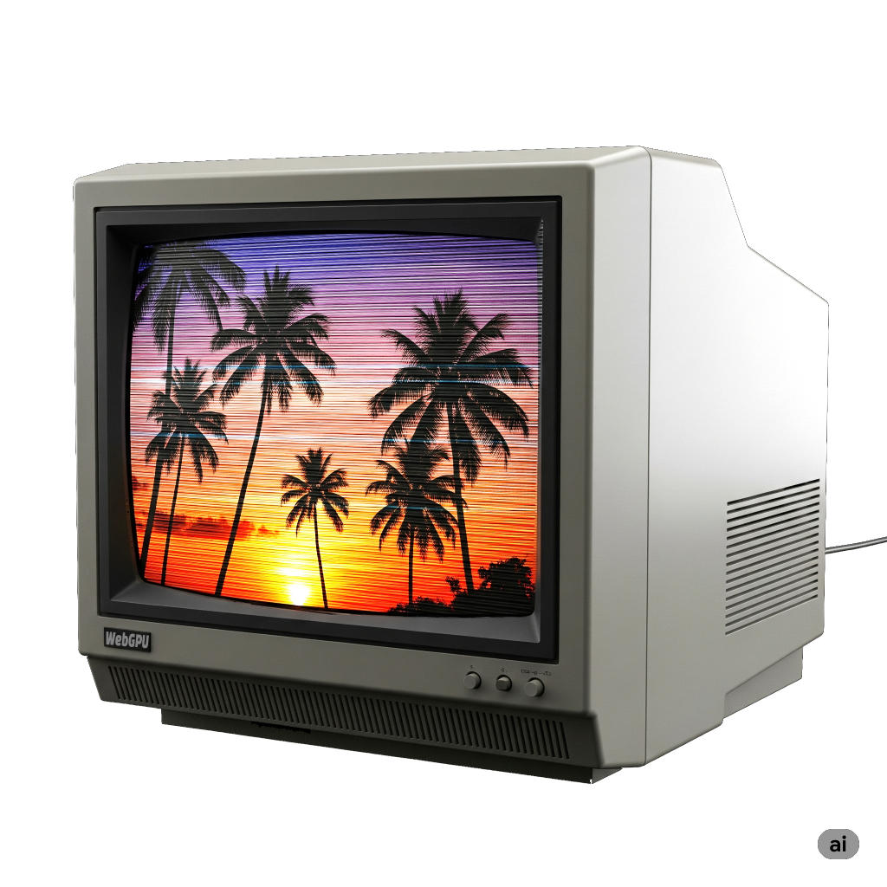

Title: WebGPU Post Processing - Basic CRT Effect
Description: Post Processing
TOC: Basic CRT Effect

Post Processing just means to do some processing after you've created the "original" image.
Post processing can apply to a photo, a video, a 2d scene, a 3d scene. It just generally
means you have an image and you apply some effects to that image, like choosing a filter
in Instagram.

In almost every example on this site we render to the canvas texture. To do post processing
we instead render to a different texture. Then render that texture to the canvas while
applying some image processing effects.

As a simple example, let's try to post process an image to make it kind of look like a 1980s TV
with scanlines and CRT RGB elements.

<div class="webgpu_center"></div>

To do that, lets take the animated example from the top of [the article on timing](webgpu-timing.html).
The first thing we'll do is make it render to a separate texture and then render that texture
to the canvas.

Here's a shader that draws a [large clip space triangle](webgpu-large-triangle-to-cover-clip-space.html).
and passes the correct UV coordinates to let as draw a texture that covers the portion of the triangle
that fits in clip space.

```js
  const postProcessModule = device.createShaderModule({
    code: `
      struct VSOutput {
        @builtin(position) position: vec4f,
        @location(0) texcoord: vec2f,
      };

      @vertex fn vs(
        @builtin(vertex_index) vertexIndex : u32,
      ) -> VSOutput {
        var pos = array(
          vec2f(-1.0, -1.0),
          vec2f(-1.0,  3.0),
          vec2f( 3.0, -1.0),
        );

        var vsOutput: VSOutput;
        let xy = pos[vertexIndex];
        vsOutput.position = vec4f(xy, 0.0, 1.0);
        vsOutput.texcoord = xy * vec2f(0.5) + vec2f(0.5);
        return vsOutput;
      }

      @group(0) @binding(0) var postTexture2d: texture_2d<f32>;
      @group(0) @binding(1) var postSampler: sampler;

      @fragment fn fs2d(fsInput: VSOutput) -> @location(0) vec4f {
        let color = textureSample(postTexture2d, postSampler, fsInput.texcoord);
        return vec4f(color);
      }
    `,
  })
```

It's pretty straight forward and is similar to the shader we used to generate mipmaps
in [the article on using images with textures](webgpu-importing-textures.html). The
only major difference is the original shader uses 2 triangles to cover clip space,
this one uses [1 large triangle](webgpu-large-triangle-to-cover-clip-space.html).

Then, to use these shaders we need a pipeline

```js
  const postProcessPipeline = device.createRenderPipeline({
    layout: 'auto',
    vertex: { module: postProcessModule },
    fragment: {
      module: postProcessModule,
      targets: [ { format: presentationFormat }],
    },
  });
```

This pipeline will be rendering to the canvas so we need to
set the target format as the `presentationFormat` we looked up before.

We'll need a sampler, and a renderPassDescriptor.

```js
  const postProcessSampler = device.createSampler({
    minFilter: 'linear',
    magFilter: 'linear',
  });

  const postProcessRenderPassDescriptor = {
    label: 'post process render pass',
    colorAttachments: [
      { loadOp: 'clear', storeOp: 'store' },
    ],
  };
```

Then, instead of having our original renderPass render
to the canvas, we need it to render to a separate texture.

```js
+  let renderTarget;
+
+  function setupPostProcess(canvasTexture) {
+    if (renderTarget?.width === canvasTexture.width &&
+        renderTarget?.height === canvasTexture.height) {
+      return;
+    }
+
+    renderTarget?.destroy();
+    renderTarget = device.createTexture({
+      size: canvasTexture,
+      format: 'rgba8unorm',
+      usage: GPUTextureUsage.RENDER_ATTACHMENT | GPUTextureUsage.TEXTURE_BINDING,
+    });
+    const renderTargetView = renderTarget.createView();
+    renderPassDescriptor.colorAttachments[0].view = renderTargetView;
+  }

  let then = 0;
  function render(now) {
    now *= 0.001;  // convert to seconds
    const deltaTime = now - then;
    then = now;

-    // Get the current texture from the canvas context and
-    // set it as the texture to render to.
-    renderPassDescriptor.colorAttachments[0].view =
-        context.getCurrentTexture().createView();
+    const canvasTexture = context.getCurrentTexture();
+    setupPostProcess(canvasTexture);

    ...
```

Above, we pass the current `canvasTexture` into `setupPostProcess`.
It checks if the size of our "renderTarget" texture is the same size
as the canvas. If not, it creates a new texture the same size.

It then sets our original `renderPassDescriptor`'s color attachment
to this renderTarget texture.

Since our old pipeline will render to this texture we need to update
it for the format of this texture

```js
  const pipeline = device.createRenderPipeline({
    label: 'per vertex color',
    layout: 'auto',
    vertex: {
      module,
      buffers: [
        ...
      ],
    },
    fragment: {
      module,
-      targets: [{ format: presentationFormat }],
+      targets: [{ format: 'rgba8unorm' }],
    },
  });
```

These change alone would make it start rendering the original scene to this
render target texture but we still need to draw something to the canvas
or we won't see anything so lets do that.

```js
  function postProcess(encoder, srcTexture, dstTexture) {
    postProcessRenderPassDescriptor.colorAttachments[0].view = dstTexture.createView();
    const pass = encoder.beginRenderPass(postProcessRenderPassDescriptor);
    pass.setPipeline(postProcessPipeline);
    pass.setBindGroup(0, postProcessBindGroup);
    pass.draw(3);
    pass.end();
  }

  ...


  let then = 0;
  function render(now) {
    now *= 0.001;  // convert to seconds
    const deltaTime = now - then;
    then = now;

    const canvasTexture = context.getCurrentTexture();
    setupPostProcess(canvasTexture);

    const encoder = device.createCommandEncoder();
    const pass = encoder.beginRenderPass(renderPassDescriptor);

    ...

    pass.draw(numVertices, settings.numObjects);

    pass.end();

+    postProcess(encoder, renderTarget, canvasTexture);

    const commandBuffer = encoder.finish();
    device.queue.submit([commandBuffer]);

    requestAnimationFrame(render);
  }
  requestAnimationFrame(render);
```

The only other tweak let's make. Let's get rid of the object count setting
since it's not relevant to post processing.

```js
  const settings = {
-    numObjects: 100,
+    numObjects: 200,
  };

  const gui = new GUI();
-  gui.add(settings, 'numObjects', 0, kNumObjects, 1);
```

We could have gotten rid of `settings.numObjects` completely but it requires
edits in several different places and so let's leave it for now. We'll set the
number to 200 just to fill the image.

If we run this there's not visible difference from our original.

{{{example url="../webgpu-post-processing-step-01.html"}}}

The difference is we're rendering to the renderTarget texture
and then rendering that texture to the canvas so now we can start
applying some effects.

The most obvious effect of an old CRT is old CRTs have visible scanlines.
This is because the way the image was projected was by using magnets
to direct a beam across the screen in a pattern of horizontal lines.

We can get a similar effect just by generating a pattern of light
and dark using a sine wave and taking the absolute value.

<div class="webgpu_center">
  <div style="width: 100%;"></div>
  <div lass="caption">sin(x)</div>
</div>
<div class="webgpu_center">
   <div style="width: 100%;"></div>
   <div class="caption">abs(sin(x))</div>
</div>
<div class="webgpu_center">
   <div style="width: 100%;"><div data-diagram="sine" style="aspect-ratio: 981 / 50; width: 100%;"></div></div>
   <div class="caption">abs(sin(x)) as gray scale color</div>
</div>


Let's add that to the code. First let's edit the shader to apply this sine wave.

```js
  const postProcessModule = device.createShaderModule({
    code: `
      struct VSOutput {
        @builtin(position) position: vec4f,
        @location(0) texcoord: vec2f,
      };

      @vertex fn vs(
        @builtin(vertex_index) vertexIndex : u32,
      ) -> VSOutput {
        var pos = array(
          vec2f(-1.0, -1.0),
          vec2f(-1.0,  3.0),
          vec2f( 3.0, -1.0),
        );

        var vsOutput: VSOutput;
        let xy = pos[vertexIndex];
        vsOutput.position = vec4f(xy, 0.0, 1.0);
        vsOutput.texcoord = xy * vec2f(0.5) + vec2f(0.5);
        return vsOutput;
      }

+      struct Uniforms {
+        effectAmount: f32,
+        bandMult: f32,
+      };

      @group(0) @binding(0) var postTexture2d: texture_2d<f32>;
      @group(0) @binding(1) var postSampler: sampler;
+      @group(0) @binding(2) var<uniform> uni: Uniforms;

      @fragment fn fs2d(fsInput: VSOutput) -> @location(0) vec4f {
+        let banding = abs(sin(fsInput.position.y * uni.bandMult));
+        let effect = mix(1.0, banding, uni.effectAmount);

        let color = textureSample(postTexture2d, postSampler, fsInput.texcoord);
-        return vec4f(color);
+        return vec4f(color.rgb * effect, color.a);
      }
    `,
  });
```

Our sine wave is based on `fsInput.position.y` which is the y coordinate of the pixel being
written to. In other words, for each scanline starting at 0 it will go 0.5, 1.5, 2.5, 3.5, etc....
`bendMult` will let us adjust the size of the bands and `effectAmount` will let us turn
the effect on and off so we can compare effect to no effect.

To use the new shader we need up a uniform buffer.

```js
  const postProcessUniformBuffer = device.createBuffer({
    size: 8,
    usage: GPUBufferUsage.UNIFORM | GPUBufferUsage.COPY_DST,
  });
```

We need to add it to our bind group

```js
    postProcessBindGroup = device.createBindGroup({
      layout: postProcessPipeline.getBindGroupLayout(0),
      entries: [
        { binding: 0, resource: renderTargetView },
        { binding: 1, resource: postProcessSampler },
+        { binding: 2, resource: { buffer: postProcessUniformBuffer }},
      ],
    });
```

And, we need to add some settings

```js
  const settings = {
    numObjects: 200,
+    affectAmount: 1,
+    bandMult: 1,
  };

  const gui = new GUI();
+  gui.add(settings, 'affectAmount', 0, 1);
+  gui.add(settings, 'bandMult', 0.01, 2.0);
```

and we need to upload those settings to the uniform buffer

```js
  function postProcess(encoder, srcTexture, dstTexture) {
+    device.queue.writeBuffer(
+      postProcessUniformBuffer,
+      0,
+      new Float32Array([
+        settings.affectAmount,
+        settings.bandMult,
+      ]),
+    );

    postProcessRenderPassDescriptor.colorAttachments[0].view = dstTexture.createView();
    const pass = encoder.beginRenderPass(postProcessRenderPassDescriptor);
    pass.setPipeline(postProcessPipeline);
    pass.setBindGroup(0, postProcessBindGroup);
    pass.draw(3);
    pass.end();
  }
```

And that gives us a CRT like scanline effect.

{{{example url="../webgpu-post-processing-step-02.html"}}}

CRTs, like LCDs, split the image into red, green, and blue areas. 
On CRTs those areas were generally larger than most LCDs today so
sometimes this stuck out. Let's add something to approximate that effect.

First let's change the shader

```
  const postProcessModule = device.createShaderModule({
    code: `
      struct VSOutput {
        @builtin(position) position: vec4f,
        @location(0) texcoord: vec2f,
      };

      @vertex fn vs(
        @builtin(vertex_index) vertexIndex : u32,
      ) -> VSOutput {
        var pos = array(
          vec2f(-1.0, -1.0),
          vec2f(-1.0,  3.0),
          vec2f( 3.0, -1.0),
        );

        var vsOutput: VSOutput;
        let xy = pos[vertexIndex];
        vsOutput.position = vec4f(xy, 0.0, 1.0);
        vsOutput.texcoord = xy * vec2f(0.5) + vec2f(0.5);
        return vsOutput;
      }

      struct Uniforms {
        effectAmount: f32,
        bandMult: f32,
+        cellMult: f32,
+        cellBright: f32,
      };

      @group(0) @binding(0) var postTexture2d: texture_2d<f32>;
      @group(0) @binding(1) var postSampler: sampler;
      @group(0) @binding(2) var<uniform> uni: Uniforms;

      @fragment fn fs2d(fsInput: VSOutput) -> @location(0) vec4f {
        let banding = abs(sin(fsInput.position.y * uni.bandMult));

+        let cellNdx = u32(fsInput.position.x * uni.cellMult) % 3;
+        var cellColor = vec3f(0);
+        cellColor[cellNdx] = 1;
+        let cMult = cellColors[cellNdx] + uni.cellBright;

-        let effect = mix(1.0, banding, uni.effectAmount);
+        let effect = mix(vec3f(1), banding * cMult, uni.effectAmount);
        let color = textureSample(postTexture2d, postSampler, fsInput.texcoord);
        return vec4f(color.rgb * effect, 1);
      }
    `,
  });
```

Above we're using `fsInput.position.x` which is the x coordinate of the
pixel being written to. By multiplying by `cellMult` we can choose a cell
size. We convert to an integer and modulo 3. This gives us a number, 0, 1, or 2
which we use to set the red, green, or blue channel of `cellColor` to 1.

We add in `cellBright` as an adjustment and then multiply both the old banding
and the new effect together. `effect` changed from an `f32` to a `vec3f` so it
can affect each channel independently.

Back in JavaScript we need to adjust the size of the uniform buffer

```js
  const postProcessUniformBuffer = device.createBuffer({
-    size: 8,
+    size: 16,
    usage: GPUBufferUsage.UNIFORM | GPUBufferUsage.COPY_DST,
  });
```

And add some settings to the GUI

```js
  const settings = {
    numObjects: 200,
    affectAmount: 1,
    bandMult: 1,
+    cellMult: 0.5,
+    cellBright: 1,
  };

  const gui = new GUI();
  gui.add(settings, 'affectAmount', 0, 1);
  gui.add(settings, 'bandMult', 0.01, 2.0);
+  gui.add(settings, 'cellMult', 0, 1);
+  gui.add(settings, 'cellBright', 0, 2);
```

and upload the new settings

```js
  function postProcess(encoder, srcTexture, dstTexture) {
    device.queue.writeBuffer(
      postProcessUniformBuffer,
      0,
      new Float32Array([
        settings.affectAmount,
        settings.bandMult,
+        settings.cellMult,
+        settings.cellBright,
      ]),
    );

    postProcessRenderPassDescriptor.colorAttachments[0].view = dstTexture.createView();
    const pass = encoder.beginRenderPass(postProcessRenderPassDescriptor);
    pass.setPipeline(postProcessPipeline);
    pass.setBindGroup(0, postProcessBindGroup);
    pass.draw(3);
    pass.end();
  }
```

And now we have a CRT color element *like* effect.

{{{example url="../webgpu-post-processing-step-03.html"}}}

The effects above are not meant to be perfect representations of how a CRT works.
Rather they were just meant to hint at looking like a CRT and be hopefully easy to
to understand. You can find fancier techniques all over the web.

## <a id="compute"></a> Using a Compute Shader

The topic comes up, could we use a compute shader for this, and, maybe
more importantly, should we? Let's cover "can we first".

We covered using a compute shader to render to a texture in
[the article on storage textures](webgpu-storage-textures.html).

To convert our code to use a compute shader we need to add
the `STORAGE_BINDING` usage to the canvas texture which, from
[the afore mentioned article](webgpu-storage-textures.html) requires
checking we can and choosing a texture format that supports it.

```js
async function main() {
  const adapter = await navigator.gpu?.requestAdapter();
+  const hasBGRA8UnormStorage = adapter?.features.has('bgra8unorm-storage');
-  const device = await adapter?.requestDevice();
+  const device = await adapter?.requestDevice({
+    requiredFeatures: [
+      ...(hasBGRA8UnormStorage ? ['bgra8unorm-storage'] : []),
+    ],
+  });
  if (!device) {
    fail('need a browser that supports WebGPU');
    return;
  }

  // Get a WebGPU context from the canvas and configure it
  const canvas = document.querySelector('canvas');
  const context = canvas.getContext('webgpu');
-  const presentationFormat = navigator.gpu.getPreferredCanvasFormat();
+  const presentationFormat = hasBGRA8UnormStorage
+    ? navigator.gpu.getPreferredCanvasFormat()
+    : 'rgab8unorm';
  context.configure({
    device,
    format: presentationFormat,
+    usage: GPUTextureUsage.RENDER_ATTACHMENT |
+           GPUTextureUsage.TEXTURE_BINDING |
+           GPUTextureUsage.STORAGE_BINDING,
  });
```

We need to switch our shader to write to a storage texture

```js
  const postProcessModule = device.createShaderModule({
    code: `
-      struct VSOutput {
-        @builtin(position) position: vec4f,
-        @location(0) texcoord: vec2f,
-      };
-
-      @vertex fn vs(
-        @builtin(vertex_index) vertexIndex : u32,
-      ) -> VSOutput {
-        var pos = array(
-          vec2f(-1.0, -1.0),
-          vec2f(-1.0,  3.0),
-          vec2f( 3.0, -1.0),
-        );
-
-        var vsOutput: VSOutput;
-        let xy = pos[vertexIndex];
-        vsOutput.position = vec4f(xy, 0.0, 1.0);
-        vsOutput.texcoord = xy * vec2f(0.5) + vec2f(0.5);
-        return vsOutput;
-      }

      struct Uniforms {
        effectAmount: f32,
        bandMult: f32,
        cellMult: f32,
        cellBright: f32,
      };

      @group(0) @binding(0) var postTexture2d: texture_2d<f32>;
      @group(0) @binding(1) var postSampler: sampler;
      @group(0) @binding(2) var<uniform> uni: Uniforms;
+      @group(1) @binding(0) var outTexture: texture_storage_2d<${presentationFormat}, write>;

-      @fragment fn fs2d(fsInput: VSOutput) -> @location(0) vec4f {
-        let banding = abs(sin(fsInput.position.y * uni.bandMult));
-
-        let cellNdx = u32(fsInput.position.x * uni.cellMult) % 3;
+      @compute @workgroup_size(1) fn cs(@builtin(global_invocation_id) gid: vec3u) {
+        let outSize = textureDimensions(outTexture);
+        let banding = abs(sin(f32(gid.y) * uni.bandMult));
+
+        let cellNdx = u32(f32(gid.x) * uni.cellMult) % 3;
        var cellColor = vec3f(0);
        cellColor[cellNdx] = 1.0;
        let cMult = cellColor + uni.cellBright;

        let effect = mix(vec3f(1), banding * cMult, uni.effectAmount);
-        let color = textureSample(postTexture2d, postSampler, fsInput.texcoord);
-        return vec4f(color.rgb * effect, color.a);
+        let uv = (vec2f(gid.xy) + 0.5) / vec2f(outSize);
+        let color = textureSampleLevel(postTexture2d, postSampler, uv, 0);
+        textureStore(outTexture, gid.xy, vec4f(color.rgb * effect, color.a));
      }
    `,
  });
```

Above we got rid of the vertex shader and related parts. We also no longer have `fsInput.position`
which was the coordinate of the pixel being written to. Instead we have `gid` which is
the `global_invocation_id` of an individual invocation of our compute shader. We'll use this
as our texture coordinate. It's a `vec3u` so we need to cast here and there. We also
no longer have `fsInput.texcoord` but we can get the equivalent with
`(vec2f(gid.xy) + 0.5) / vec2f(outSize)`.

We need to stop using a render pass and instead use a compute pass for our post processing.

```js
  const postProcessPipeline = device.createRenderPipeline({
    layout: 'auto',
-    vertex: { module: postProcessModule },
-    fragment: {
-      module: postProcessModule,
-      targets: [ { format: presentationFormat }],
-    },
+    compute: { module: postProcessModule },
  });

  function postProcess(encoder, srcTexture, dstTexture) {
    device.queue.writeBuffer(
      postProcessUniformBuffer,
      0,
      new Float32Array([
        settings.affectAmount,
        settings.bandMult,
        settings.cellMult,
        settings.cellBright,
      ]),
    );

+    const outBindGroup = device.createBindGroup({
+      layout: postProcessPipeline.getBindGroupLayout(1),
+      entries: [
+        { binding: 0, resource: dstTexture.createView() },
+      ],
+    });

-    postProcessRenderPassDescriptor.colorAttachments[0].view = dstTexture.createView();
-    const pass = encoder.beginRenderPass(postProcessRenderPassDescriptor);
+    const pass = encoder.beginComputePass();
    pass.setPipeline(postProcessPipeline);
    pass.setBindGroup(0, postProcessBindGroup);
-    pass.draw(3);
+    pass.dispatchWorkgroups(dstTexture.width, dstTexture.height);
    pass.end();
  }
```

That works

{{{example url="../webgpu-post-processing-step-03-compute.html"}}}

Unfortunately, depending on the GPU, it's slow! We covered some of why in
[the article on optimizing compute shaders](webgpu-compute-shaders-historgram.html).
Using a workgroup size of 1 makes things easy but it's slow.

We can update to use a larger workgroup size. This requires us to skip writing
to the texture when we're out of bounds.

```js
+  const workgroupSize = [16, 16];
  const postProcessModule = device.createShaderModule({
    code: `
      struct Uniforms {
        effectAmount: f32,
        bandMult: f32,
        cellMult: f32,
        cellBright: f32,
      };

      @group(0) @binding(0) var postTexture2d: texture_2d<f32>;
      @group(0) @binding(1) var postSampler: sampler;
      @group(0) @binding(2) var<uniform> uni: Uniforms;
      @group(1) @binding(0) var outTexture: texture_storage_2d<${presentationFormat}, write>;

-      @compute @workgroup_size(1) fn cs(@builtin(global_invocation_id) gid: vec3u) {
+      @compute @workgroup_size(${workgroupSize}) fn cs(@builtin(global_invocation_id) gid: vec3u) {
        let outSize = textureDimensions(outTexture);
+        if (gid.x >= outSize.x || gid.y >= outSize.y) {
+          return;
+        }
        let banding = abs(sin(f32(gid.y) * uni.bandMult));

        let cellNdx = u32(f32(gid.x) * uni.cellMult) % 3;
        var cellColor = vec3f(0);
        cellColor[cellNdx] = 1.0;
        let cMult = cellColor + uni.cellBright;

        let effect = mix(vec3f(1), banding * cMult, uni.effectAmount);
        let uv = (vec2f(gid.xy) + 0.5) / vec2f(outSize);
        let color = textureSampleLevel(postTexture2d, postSampler, uv, 0);
        textureStore(outTexture, gid.xy, vec4f(color.rgb * effect, color.a));
      }
    `,
  });
```

And then we need to dispatch less workgroups

```js
    const pass = encoder.beginComputePass();
    pass.setPipeline(postProcessPipeline);
    pass.setBindGroup(0, postProcessBindGroup);
    pass.setBindGroup(1, outBindGroup);
-    pass.dispatchWorkgroups(dstTexture.width, dstTexture.height);
+    pass.dispatchWorkgroups(
+      Math.ceil(dstTexture.width / workgroupSize[0]),
+      Math.ceil(dstTexture.height / workgroupSize[1]),
+    );
    pass.end();
```

This works

{{{example url="../webgpu-post-processing-step-03-compute-workgroups.html"}}}

This is much faster! But, unfortunately, on some GPUs it is still slower than using a render pass.


<div class="webgpu_center data-table">
  <table>
    <thead>
      <tr><th>GPU</th><th>Compute pass time vs<br>Render pass time<br>(higher is worse)</th></tr>
    </thead>
    <tbody>
      <tr><td>M1 Mac                 </td><td>1x</td></tr>
      <tr><td>AMD Radeon Pro 5300M   </td><td>1x</td></tr>
      <tr><td>AMD Radeon Pro WX 32000</td><td>1.3x</td></tr>
      <tr><td>Intel UHD Graphics 630 </td><td>1.7x</td></tr>
      <tr><td>NVidia 2070 Super      </td><td>2x</td></tr>
    </tbody>
  </table>
</div>

Going into how to make it faster is too big of a topic for this particular article.
Referencing [the article on optimizing compute shaders](webgpu-compute-shaders-historgram.html),
the same rules apply. Unfortunately none of them are really relevant to this example.
If the post processing you're trying to do could benefit from shared workgroup memory
then maybe using a compute shader would be beneficial. Access patterns might be relevant
too to try to make sure the GPU isn't getting lots of cache misses. Yet another might
be taking advantage of [subgroups](webgpu-subgroups.html).

For now, it's recommended you try different techniques and checking their timing.
Or, stick with render passes unless the algorithm you're implementing could truly
benefit from the shared data of workgroups and or subgroups. GPUs have been rendering
to textures for much longer than they've been running compute shaders so many things
about that process are highly optimized.

<!-- keep this at the bottom of the article -->
<link href="webgpu-post-processing.css" rel="stylesheet">
<script type="module" src="webgpu-post-processing.js"></script>
