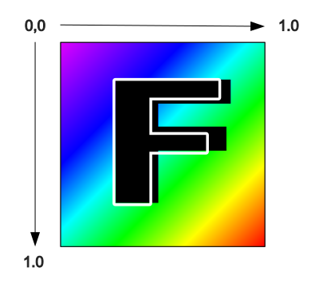
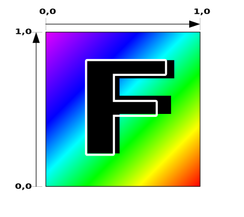

Title: WebGPU Textures
Description: How to use Textures
TOC: Textures

In this article we'll cover the fundamentals of textures. In previous articles
we covered the other major ways to pass data into a shader. They were
[inter-stage variables](webgpu-inter-stage-variables.html),
[uniforms](webgpu-uniforms.html), [storage-buffers](webgpu-storage-buffers.html),
and [vertex-buffers](webgpu-vertex-buffers). The last major way to pass data
into a shader is textures.

Textures most often represent a 2d image. A 2d image is just a 2d array of color
values so you might wonder, why do we need textures for 2d arrays? We could just
use storage buffers as 2d arrays. What makes textures special is that they can
be accessed by special hardware called a *sampler*. A sampler can read up to 16
different values in a texture and blend them together in a way that is useful
for many common use cases.

As one example, lets say I want to draw a 2d image larger than its original size.

<div class="webgpu_center">
  <div>
    <div></div>
    <div style="text-align: center;">original</div>
  </div>
</div>

If we just simply take a single pixel from the original image to make each pixel
in the larger image we'll end up with the first example below. If instead, for a
given pixel in the larger image we consider multiple pixels from the original
image we can get results like the 2nd image below which should hopefully show
up as less pixelated.

<div class="webgpu_center compare">
  <div>
    <div></div>
    <div>un-filtered</div>
  </div>
  <div>
    <div></div>
    <div>filtered</div>
  </div>
</div>

While there are WGSL functions that will get an individual pixel from a texture
and there are use cases for that, those functions are not all that interesting
because we could do the same with storage buffers. The interesting WGSL
functions for textures are ones that filter and blend multiple pixels.

These WGSL functions take a texture which represents that data, a sampler which
represents how we want to pull data out of the texture, and a texture coordinate
which specifies where we want to get a value from the texture.

Texture coordinates for sampled textures go from 0.0 to 1.0 across and down a
texture regardless of the actual size of the texture. [^up-or-down]

[^up-or-down]: Whether texture coordinates go up (0 = bottom, 1 = top) or down (0 = top, 1 = bottom) is
a matter of perspective. What's important is that texture coordinate 0,0 references the first data in
the texture.

<div class="webgpu_center"></div>

Let's take one of our samples from [the article on inter-stage variables](webgpu-inter-stage-variables.html)
and modify it to draw a quad (2 triangles) with a texture.

```wgsl
struct OurVertexShaderOutput {
  @builtin(position) position: vec4f,
-  @location(0) color: vec4f,
+  @location(0) texcoord: vec2f,
};

@vertex fn vs(
  @builtin(vertex_index) vertexIndex : u32
) -> OurVertexShaderOutput {
-  let pos = array(
-    vec2f( 0.0,  0.5),  // top center
-    vec2f(-0.5, -0.5),  // bottom left
-    vec2f( 0.5, -0.5)   // bottom right
-  );
-  var color = array<vec4f, 3>(
-    vec4f(1, 0, 0, 1), // red
-    vec4f(0, 1, 0, 1), // green
-    vec4f(0, 0, 1, 1), // blue
-  );
+  let pos = array(
+    // 1st triangle
+    vec2f( 0.0,  0.0),  // center
+    vec2f( 1.0,  0.0),  // right, center
+    vec2f( 0.0,  1.0),  // center, top
+
+    // 2st triangle
+    vec2f( 0.0,  1.0),  // center, top
+    vec2f( 1.0,  0.0),  // right, center
+    vec2f( 1.0,  1.0),  // right, top
+  );

  var vsOutput: OurVertexShaderOutput;
-  vsOutput.position = vec4f(pos[vertexIndex], 0.0, 1.0);
-  vsOutput.color = color[vertexIndex];
+  let xy = pos[vertexIndex];
+  vsOutput.position = vec4f(xy, 0.0, 1.0);
+  vsOutput.texcoord = xy;
  return vsOutput;
}

+@group(0) @binding(0) var ourSampler: sampler;
+@group(0) @binding(1) var ourTexture: texture_2d<f32>;

@fragment fn fs(fsInput: OurVertexShaderOutput) -> @location(0) vec4f {
-  return fsInput.color;
+  return textureSample(ourTexture, ourSampler, fsInput.texcoord);
}
```

Above we changed from 3 vertices that draw a centered triangle to 6 vertices
that draw a quad in the top right corner of the canvas.

We changed `OutVertexShaderOutput` to pass `texcoord`, a `vec2f` so we can
pass texture coordinates to the fragment shader. We changed the vertex shader
to set `vsOutput.texcoord` to the same as the clip space position we pulled
out of our hard coded array of positions. `vsOutput.texcoord` will be
interpolated between the 3 vertices of each triangle when passed to the
fragment shader.

We then declared a sampler and texture and referenced those in our fragment
shader. The function `textureSample` *samples* a texture. The first parameter
is the texture to sample. The 2nd parameter is the sampler to specify how
to sample the texture. The 3rd is the texture coordinate for where to sample.

> Note: It is not common to pass position values as texture coordinates
> but in this particular case of unit quad (a quad one unit wide and one unit tall) it just so 
> happens that the texture coordinates we need match the positions.
> Doing it this way keeps the example smaller and simpler. It would be
> far more common to provide texture coordinates via
> [vertex-buffers](webgpu-vertex-buffers.html).

Now we need to create texture data. We'll make a 5x7 texel `F` [^texel]

[^texel]: A texel is short for "texture element" vs a pixel which is short for "picture element".
For me texel and pixel are basically synonymous but some people prefer to use
the word *texel* when discussing textures.

```js
  const kTextureWidth = 5;
  const kTextureHeight = 7;
  const _ = [255,   0,   0, 255];  // red
  const y = [255, 255,   0, 255];  // yellow
  const b = [  0,   0, 255, 255];  // blue
  const textureData = new Uint8Array([
    b, _, _, _, _,
    _, y, y, y, _,
    _, y, _, _, _,
    _, y, y, _, _,
    _, y, _, _, _,
    _, y, _, _, _,
    _, _, _, _, _,
  ].flat());
```

Hopefully you can see the `F` in there as well as a blue texel in the top
left corner (the first value).

We're going to create a `rgba8unorm` texture. `rgba8unorm` means the texture will
have red, green, blue, and alpha values. Each value will be 8 bits unsigned, and
will be normalized when used in the texture. `unorm` means `unsigned normalized`
which is fancy way of saying the value will be converted from an unsigned byte
with values from (0 to 255) to a floating point value with values (0.0 to 1.0).

In other words if the value we put in the texture is `[64, 128, 192, 255]` the value
in the shader will end up being `[64 / 255, 128 / 255, 192 / 255, 255 / 255]` or to
put it another way `[0.25, 0.50, 0.75, 1.00]`

Now that we have the data we need to make a texture

```js
  const texture = device.createTexture({
    size: [kTextureWidth, kTextureHeight],
    format: 'rgba8unorm',
    usage: GPUTextureUsage.TEXTURE_BINDING | GPUTextureUsage.COPY_DST,
  });
```

For `device.createTexture`, the `size` parameter should be pretty obvious. The
format is `rgba8unorm` as mentioned above. For the `usage`, `GPUTextureUsage.TEXTURE_BINDING`
says we want to be able to bind this texture into a bind group [^texture-binding] and `COPY_DST`
means we want to be able to copy data to it.

[^texture-binding]: Another common use for a texture is `GPUTextureUsage.RENDER_ATTACHMENT`
which is used for a texture we want to render into. As an example, the canvas texture we
get from `context.getCurrentTexture()` has its usage set to `GPUTextureUsage.RENDER_ATTACHMENT`
by default.

Next we need to do just that and copy our data to it.

```js
  device.queue.writeTexture(
      { texture },
      textureData,
      { bytesPerRow: kTextureWidth * 4 },
      { width: kTextureWidth, height: kTextureHeight },
  );
```

For `device.queue.writeTexture` the first parameter is the texture we want to update.
The second is the data we want to copy to it. The 3rd defines how to read that data
when copying it to the texture. `bytesPerRow` specifies how many bytes to get from
one row of the source data to the next row. Finally, the last parameter specifies
the size of the copy.

We also need to make a sampler

```js
  const sampler = device.createSampler();
```

We need to add both the texture and the sampler to a bind group with bindings
that match the `@binding(?)`s we put in the shader.

```js
  const bindGroup = device.createBindGroup({
    layout: pipeline.getBindGroupLayout(0),
    entries: [
      { binding: 0, resource: sampler },
      { binding: 1, resource: texture.createView() },
    ],
  });
```

To update our rendering, we need to specify the bind group and render 6 vertices
to render our quad consisting of 2 triangles.

```js
    const pass = encoder.beginRenderPass(renderPassDescriptor);
    pass.setPipeline(pipeline);
+    pass.setBindGroup(0, bindGroup);
-    pass.draw(3);  // call our vertex shader 3 times
+    pass.draw(6);  // call our vertex shader 6 times
    pass.end();
```

and running it we get this

{{{example url="../webgpu-simple-textured-quad.html"}}}

**Why is the F upside down?**

If you go back and reference the texture coordinate diagram again you can see
that texture coordinate 0,0 references the first texel of the texture. The
position in the center of the canvas of our quad is 0,0 and we use that value as
a texture coordinate so it's doing what the diagram shows, a 0,0 texture
coordinate is referencing the first blue texel.

To fix this there are 2 common solutions.

1. Flip the texture coordinates

   In this example we could change the texture coordinate in either
   the vertex shader
   
   ```wgsl
   -  vsOutput.texcoord = xy;
   +  vsOutput.texcoord = vec2f(xy.x, 1.0 - xy.y);
   ```
   
   or fragment shader

   ```wgsl
   -  return textureSample(ourTexture, ourSampler, fsInput.texcoord);
   +  let texcoord = vec2f(fsInput.texcoord.x, 1.0 - fsInput.texcoord.y);
   +  return textureSample(ourTexture, ourSampler, texcoord);
   ```

   Of course if we were supplying texture coordinates via [vertex buffers](webgpu-vertex-buffers.html)
   or [storage buffers](webgpu-storage-buffers.html) then ideally we'd flip them
   at the source.

2. Flip the texture data

   ```js
    const textureData = new Uint8Array([
   -   b, _, _, _, _,
   -   _, y, y, y, _,
   -   _, y, _, _, _,
   -   _, y, y, _, _,
   -   _, y, _, _, _,
   -   _, y, _, _, _,
   -   _, _, _, _, _,
   +   _, _, _, _, _,
   +   _, y, _, _, _,
   +   _, y, _, _, _,
   +   _, y, y, _, _,
   +   _, y, _, _, _,
   +   _, y, y, y, _,
   +   b, _, _, _, _,
    ].flat());
   ```

   Once we've flipped the data, what used to be at the top is now at the bottom
   and now the bottom left pixel of the original image is the first data
   in the texture and becomes what texture coordinate 0,0 refers to. This is why
   often texture coordinates are considered to go from 0 at the bottom to 1 at
   the top.

   <div class="webgpu_center"></div>

   Flipping the data is common enough that there are even options when loading
   textures from images, videos, and canvases to flip the data for you.

## <a id="a-mag-filter"></a>magFilter

In the example above we use a sampler with its default settings. Since we are
drawing the 5x7 texture larger than it's original 5x7 texels the sampler uses
what's called the `magFilter` or, the filter used when magnifying the texture.
If we change it from `nearest` to `linear` then it will linearly interpolate
between 4 pixels.

<a id="a-linear-interpolation"></a>
<div class="webgpu_center center diagram"><div data-diagram="linear-interpolation" style="display: inline-block; width: 600px;"></div></div>

Texture coordinates are often called "UVs" (pronounced you-vees) so, in the
diagram above, `uv` is the texture coordinate. For a given uv, the closest 4
pixels are chosen. `t1` is the horizontal distance between the top left chosen
pixel's center and the pixel to its right's center where 0 means we are
horizontally at the left pixel's center and 1 means we are horizontally at the
right chosen pixel's center. `t2` is similar but vertically.

`t1` is the used to *"mix"* between the top 2 pixels to produce an intermediate
color. *mix* linearly interpolates between 2 values so when `t1` is 0 we get only
the first color. When `t1` = 1 we get only the second color. Values between 0
and 1 produce a proportional mix. For example 0.3 would be would be 70% of the
first color and 30% of second color. Similarly, a second intermediate color is
computed for the bottom 2 pixels. Finally, `t2` is used to mix the two
intermediate colors into a final color.

Another thing to notice, at the bottom of the diagram are 2 more sampler
settings, `addressModeU` and `addressModeV`. We can set these to `repeat` or
`clamp-to-edge` [^mirror-repeat]. When set to 'repeat', when our texture
coordinate is within half a texel of the edge of the texture we wrap around and
blend with pixels on the opposite side of the texture. When set to
'clamp-to-edge', for the purposes of calculating which color to return, the
texture coordinate is clamped so that it can't go into the last half texel on
each edge. This has the effect of showing the edge colors for any texture
coordinate outside that range.

[^mirror-repeat]: There is also one more address mode, "mirror-repeat".
If our texture is "🟥🟩🟦" then repeat goes "🟥🟩🟦🟥🟩🟦🟥🟩🟦🟥🟩🟦" and mirror-repeat
goes "🟥🟩🟦🟦🟩🟥🟥🟩🟦🟦🟩🟥"

Let's update the example so we can draw the quad with all of these options.

First let's create a sampler for each combination of settings.
We'll also create a bind group that uses that sampler.

```js
+  const bindGroups = [];
+  for (let i = 0; i < 8; ++i) {
-   const sampler = device.createSampler();
+   const sampler = device.createSampler({
+      addressModeU: (i & 1) ? 'repeat' : 'clamp-to-edge',
+      addressModeV: (i & 2) ? 'repeat' : 'clamp-to-edge',
+      magFilter: (i & 4) ? 'linear' : 'nearest',
+    });

    const bindGroup = device.createBindGroup({
      layout: pipeline.getBindGroupLayout(0),
      entries: [
        { binding: 0, resource: sampler },
        { binding: 1, resource: texture.createView() },
      ],
    });
+    bindGroups.push(bindGroup);
+  }
```

We'll make some settings

```js
  const settings = {
    addressModeU: 'repeat',
    addressModeV: 'repeat',
    magFilter: 'linear',
  };
```

and at render time we'll look at the settings to decide which
bind group to use.

```js
  function render() {
+    const ndx = (settings.addressModeU === 'repeat' ? 1 : 0) +
+                (settings.addressModeV === 'repeat' ? 2 : 0) +
+                (settings.magFilter === 'linear' ? 4 : 0);
+    const bindGroup = bindGroups[ndx];
   ...
```

Now all we need to do is provide some UI to let us change the settings
and when the setting change we need to re-render. I'm using a library
called "muigui" which at the moment has an API similar to [dat.GUI](https://github.com/dataarts/dat.gui)

```js
import GUI from '../3rdparty/muigui-0.x.module.js';

...

  const settings = {
    addressModeU: 'repeat',
    addressModeV: 'repeat',
    magFilter: 'linear',
  };

  const addressOptions = ['repeat', 'clamp-to-edge'];
  const filterOptions = ['nearest', 'linear'];

  const gui = new GUI();
  gui.onChange(render);
  Object.assign(gui.domElement.style, {right: '', left: '15px'});
  gui.add(settings, 'addressModeU', addressOptions);
  gui.add(settings, 'addressModeV', addressOptions);
  gui.add(settings, 'magFilter', filterOptions);
```

The code above declares `settings` and then creates a UI to set them
and calls `render` when they change.

{{{example url="../webgpu-simple-textured-quad-linear.html"}}}

Since our fragment shader is receiving interpolated texture coordinates, as our
shader calls `textureSample` with those coordinates, it gets different blended
colors as it's asked to provide a color for each pixel being rendered. Notice
how with the address modes set to 'repeat' we can see WebGPU is "sampling" from
the texels on the opposite side of the texture.

## <a id="a-min-filter"></a>minFilter

There is also a setting, `minFilter`, which does similar math to `magFilter`
for when the texture is drawn smaller than its size. When set to 'linear'
it also chooses 4 pixels and blends them following similar math to that above.

The problem is, choosing 4 blended pixels from larger texture to render say 1
pixel, the color will change and we'll get flickering.

Let's do it so we can see the issue

First let's make our canvas low-res. To do this we need to update our
css so the browser doesn't do the same `magFilter: 'linear'` effect on
our canvas. We can do this by setting the css as follows

```css
canvas {
  display: block;  /* make the canvas act like a block   */
  width: 100%;     /* make the canvas fill its container */
  height: 100%;
+  image-rendering: pixelated;
+  image-rendering: crisp-edges;
}
```

Next let's lower the resolution of the canvas in our `ResizeObserver` callback

```js
  const observer = new ResizeObserver(entries => {
    for (const entry of entries) {
      const canvas = entry.target;
-      const width = entry.contentBoxSize[0].inlineSize / 64 | 0;
-      const height = entry.contentBoxSize[0].blockSize / 64 | 0;
+      const width = entry.contentBoxSize[0].inlineSize / 64 | 0;
+      const height = entry.contentBoxSize[0].blockSize / 64 | 0;
      canvas.width = Math.max(1, Math.min(width, device.limits.maxTextureDimension2D));
      canvas.height = Math.max(1, Math.min(height, device.limits.maxTextureDimension2D));
      // re-render
      render();
    }
  });
  observer.observe(canvas);
```

We're going to move and scale the quad so we'll add in a uniform buffer just
like we did in the first example in [the article on uniforms](webgpu-uniforms.html).

```wgsl
struct OurVertexShaderOutput {
  @builtin(position) position: vec4f,
  @location(0) texcoord: vec2f,
};

+struct Uniforms {
+  scale: vec2f,
+  offset: vec2f,
+};
+
+@group(0) @binding(2) var<uniform> uni: Uniforms;

@vertex fn vs(
  @builtin(vertex_index) vertexIndex : u32
) -> OurVertexShaderOutput {
  let pos = array(
    // 1st triangle
    vec2f( 0.0,  0.0),  // center
    vec2f( 1.0,  0.0),  // right, center
    vec2f( 0.0,  1.0),  // center, top

    // 2st triangle
    vec2f( 0.0,  1.0),  // center, top
    vec2f( 1.0,  0.0),  // right, center
    vec2f( 1.0,  1.0),  // right, top
  );

  var vsOutput: OurVertexShaderOutput;
  let xy = pos[vertexIndex];
-  vsOutput.position = vec4f(xy, 0.0, 1.0);
+  vsOutput.position = vec4f(xy * uni.scale + uni.offset, 0.0, 1.0);
  vsOutput.texcoord = xy;
  return vsOutput;
}

@group(0) @binding(0) var ourSampler: sampler;
@group(0) @binding(1) var ourTexture: texture_2d<f32>;

@fragment fn fs(fsInput: OurVertexShaderOutput) -> @location(0) vec4f {
  return textureSample(ourTexture, ourSampler, fsInput.texcoord);
}
```

Now that we have uniforms, we need to create a uniform buffer and
add it to the bind group.

```js
+  // create a buffer for the uniform values
+  const uniformBufferSize =
+    2 * 4 + // scale is 2 32bit floats (4bytes each)
+    2 * 4;  // offset is 2 32bit floats (4bytes each)
+  const uniformBuffer = device.createBuffer({
+    label: 'uniforms for quad',
+    size: uniformBufferSize,
+    usage: GPUBufferUsage.UNIFORM | GPUBufferUsage.COPY_DST,
+  });
+
+  // create a typedarray to hold the values for the uniforms in JavaScript
+  const uniformValues = new Float32Array(uniformBufferSize / 4);
+
+  // offsets to the various uniform values in float32 indices
+  const kScaleOffset = 0;
+  const kOffsetOffset = 2;

  const bindGroups = [];
  for (let i = 0; i < 8; ++i) {
    const sampler = device.createSampler({
      addressModeU: (i & 1) ? 'repeat' : 'clamp-to-edge',
      addressModeV: (i & 2) ? 'repeat' : 'clamp-to-edge',
      magFilter: (i & 4) ? 'linear' : 'nearest',
    });

    const bindGroup = device.createBindGroup({
      layout: pipeline.getBindGroupLayout(0),
      entries: [
        { binding: 0, resource: sampler },
        { binding: 1, resource: texture.createView() },
+        { binding: 2, resource: { buffer: uniformBuffer }},
      ],
    });
    bindGroups.push(bindGroup);
  }
```

And we need code to set the uniform's values and upload them to the GPU.
We're going to animate this so we'll also change the code use
`requestAnimationFrame` to continuously render.

```js
  function render(time) {
    time *= 0.001;
    const ndx = (settings.addressModeU === 'repeat' ? 1 : 0) +
                (settings.addressModeV === 'repeat' ? 2 : 0) +
                (settings.magFilter === 'linear' ? 4 : 0);
    const bindGroup = bindGroups[ndx];

+    // compute a scale that will draw our 0 to 1 clip space quad
+    // 2x2 pixels in the canvas.
+    const scaleX = 4 / canvas.width;
+    const scaleY = 4 / canvas.height;
+
+    uniformValues.set([scaleX, scaleY], kScaleOffset); // set the scale
+    uniformValues.set([Math.sin(time * 0.25) * 0.8, -0.8], kOffsetOffset); // set the offset
+
+    // copy the values from JavaScript to the GPU
+    device.queue.writeBuffer(uniformBuffer, 0, uniformValues);

    ...

+    requestAnimationFrame(render);
  }
+  requestAnimationFrame(render);

  const observer = new ResizeObserver(entries => {
    for (const entry of entries) {
      const canvas = entry.target;
      const width = entry.contentBoxSize[0].inlineSize / 64 | 0;
      const height = entry.contentBoxSize[0].blockSize / 64 | 0;
      canvas.width = Math.max(1, Math.min(width, device.limits.maxTextureDimension2D));
      canvas.height = Math.max(1, Math.min(height, device.limits.maxTextureDimension2D));
-      // re-render
-      render();
    }
  });
  observer.observe(canvas);
}
```

The code above sets the scale so that we'll draw the quad the size of 2x2 pixels in the canvas.
It also sets the offset from -0.8 to +0.8 using `Math.sin` so that the quad will
slowly go back and forth across the canvas.

Finally let's add `minFilter` to our settings and combinations

```js
  const bindGroups = [];
  for (let i = 0; i < 16; ++i) {
    const sampler = device.createSampler({
      addressModeU: (i & 1) ? 'repeat' : 'clamp-to-edge',
      addressModeV: (i & 2) ? 'repeat' : 'clamp-to-edge',
      magFilter: (i & 4) ? 'linear' : 'nearest',
+      minFilter: (i & 8) ? 'linear' : 'nearest',
    });

...

  const settings = {
    addressModeU: 'repeat',
    addressModeV: 'repeat',
    magFilter: 'linear',
+    minFilter: 'linear',
  };

  const addressOptions = ['repeat', 'clamp-to-edge'];
  const filterOptions = ['nearest', 'linear'];

  const gui = new GUI();
-  gui.onChange(render);
  Object.assign(gui.domElement.style, {right: '', left: '15px'});
  gui.add(settings, 'addressModeU', addressOptions);
  gui.add(settings, 'addressModeV', addressOptions);
  gui.add(settings, 'magFilter', filterOptions);
+  gui.add(settings, 'minFilter', filterOptions);

  function render(time) {
    time *= 0.001;
    const ndx = (settings.addressModeU === 'repeat' ? 1 : 0) +
                (settings.addressModeV === 'repeat' ? 2 : 0) +
-                (settings.magFilter === 'linear' ? 4 : 0);
+                (settings.magFilter === 'linear' ? 4 : 0) +
+                (settings.minFilter === 'linear' ? 8 : 0);
```

We no longer need to call `render` when a setting changes since we're
rendering constantly using `requestAnimationFrame` (often called "rAF"
and this style of rendering loop is often called a "rAF loop")

{{{example url="../webgpu-simple-textured-quad-minfilter.html"}}}

You can see the quad is flickering and changing colors. If the `minFilter`
is set to `nearest` then for each of the 2x2 pixels of the quad it's picking 
one pixel from our texture. If you set it to `linear` then it does the
bilinear filtering we mentioned above but it still flickers.

One reason is, the quad is positioned with real numbers but pixels are integers.
The texture coordinates are interpolated from the real numbers, or rather, they
are computed from the real numbers.

<a id="a-pixel-to-texcoords"></a>
<div class="webgpu_center center diagram">
  <div class="fit-container">
    <div class="text-align: center">drag to move</div>
    <div class="fit-container" data-diagram="pixel-to-texcoords" style="display: inline-block; width: 600px;"></div>
  </div>
</div>

In the diagram above, the <span style="color: red;">red</span> rectangle
represents the quad we asked the GPU to draw based on the values we return
from our vertex shader. When the GPU draws, it computes which pixels' centers
are inside our quad (our 2 triangles). Then, it computes what interpolated
inter-stage variable value to pass to the fragment shader based on where the
center of the pixel to be drawn is relative to the where the original points
are. In our fragment shader we then pass that texture coordinate to the WGSL
`textureSample` function and get back a sampled color as the previous diagram
showed. Hopefully you can see why the colors are flickering. You can see them
blend to different colors depending on which UV coordinates are computed for the
pixel being drawn.

Textures offer a solution to this problem. It's called mip-mapping. I think (but
could be wrong) that "mipmap" stands for "multi-image-pyramid-map".

We take our texture and create a smaller texture that is half the size in each
dimension, rounding down. We then fill the smaller texture with blended colors
from the first original texture. We repeat this until we get to a 1x1 texture.
In our example we have a 5x7 texel texture. Dividing by 2 in each dimension and
rounding down gives us a 2x3 texel texture. We take that one and repeat so we
end up with 1x1 texel texture.

<div class="webgpu_center center diagram"><div data-diagram="mips" style="display: inline-block;"></div></div>

Given a mipmap, we can then ask the GPU to choose a smaller mip level when we're
drawing something smaller than the original texture size. This will look better
because it has been "pre-blended" and better represents what the texture's color
would be when scaled down.

The best algorithm for blending the pixels from one mip to the next is a topic
of research as well as a matter of opinion. As a first idea, here's some code
that generates each mip from the previous mip by bilinear filtering (as
demonstrated above).

```js
const lerp = (a, b, t) => a + (b - a) * t;
const mix = (a, b, t) => a.map((v, i) => lerp(v, b[i], t));
const bilinearFilter = (tl, tr, bl, br, t1, t2) => {
  const t = mix(tl, tr, t1);
  const b = mix(bl, br, t1);
  return mix(t, b, t2);
};

const createNextMipLevelRgba8Unorm = ({data: src, width: srcWidth, height: srcHeight}) => {
  // compute the size of the next mip
  const dstWidth = Math.max(1, srcWidth / 2 | 0);
  const dstHeight = Math.max(1, srcHeight / 2 | 0);
  const dst = new Uint8Array(dstWidth * dstHeight * 4);

  const getSrcPixel = (x, y) => {
    const offset = (y * srcWidth + x) * 4;
    return src.subarray(offset, offset + 4);
  };

  for (let y = 0; y < dstHeight; ++y) {
    for (let x = 0; x < dstWidth; ++x) {
      // compute texcoord of the center of the destination texel
      const u = (x + 0.5) / dstWidth;
      const v = (y + 0.5) / dstHeight;

      // compute the same texcoord in the source - 0.5 a pixel
      const au = (u * srcWidth - 0.5);
      const av = (v * srcHeight - 0.5);

      // compute the src top left texel coord (not texcoord)
      const tx = au | 0;
      const ty = av | 0;

      // compute the mix amounts between pixels
      const t1 = au % 1;
      const t2 = av % 1;

      // get the 4 pixels
      const tl = getSrcPixel(tx, ty);
      const tr = getSrcPixel(tx + 1, ty);
      const bl = getSrcPixel(tx, ty + 1);
      const br = getSrcPixel(tx + 1, ty + 1);

      // copy the "sampled" result into the dest.
      const dstOffset = (y * dstWidth + x) * 4;
      dst.set(bilinearFilter(tl, tr, bl, br, t1, t2), dstOffset);
    }
  }
  return { data: dst, width: dstWidth, height: dstHeight };
};

const generateMips = (src, srcWidth) => {
  const srcHeight = src.length / 4 / srcWidth;

  // populate with first mip level (base level)
  let mip = { data: src, width: srcWidth, height: srcHeight, };
  const mips = [mip];

  while (mip.width > 1 || mip.height > 1) {
    mip = createNextMipLevelRgba8Unorm(mip);
    mips.push(mip);
  }
  return mips;
};
```

We'll go over how to do this on the GPU in [another article](webgpu-importing-textures.html).
For now, we can use the code above to generate a mipmap.

We pass our texture data to the function above, and it returns an array of mip level data.
We can then create a texture with all the mip levels

```js
  const mips = generateMips(textureData, kTextureWidth);

  const texture = device.createTexture({
    label: 'yellow F on red',
+    size: [mips[0].width, mips[0].height],
+    mipLevelCount: mips.length,
    format: 'rgba8unorm',
    usage:
      GPUTextureUsage.TEXTURE_BINDING |
      GPUTextureUsage.COPY_DST,
  });
  mips.forEach(({data, width, height}, mipLevel) => {
    device.queue.writeTexture(
-      { texture },
-      textureData,
-      { bytesPerRow: kTextureWidth * 4 },
-      { width: kTextureWidth, height: kTextureHeight },
+      { texture, mipLevel },
+      data,
+      { bytesPerRow: width * 4 },
+      { width, height },
    );
  });
```

Notice we pass in `mipLevelCount` to the number of mip levels. WebGPU will then
create the correct sized mip level at each level. We then copy the data to each
level by specifying the `mipLevel`

Let's also add a scale setting so we can see the quad drawn at different sizes.

```js
  const settings = {
    addressModeU: 'repeat',
    addressModeV: 'repeat',
    magFilter: 'linear',
    minFilter: 'linear',
+    scale: 1,
  };

  ...

  const gui = new GUI();
  Object.assign(gui.domElement.style, {right: '', left: '15px'});
  gui.add(settings, 'addressModeU', addressOptions);
  gui.add(settings, 'addressModeV', addressOptions);
  gui.add(settings, 'magFilter', filterOptions);
  gui.add(settings, 'minFilter', filterOptions);
+  gui.add(settings, 'scale', 0.5, 6);

  function render(time) {

    ...

-    const scaleX = 4 / canvas.width;
-    const scaleY = 4 / canvas.height;
+    const scaleX = 4 / canvas.width * settings.scale;
+    const scaleY = 4 / canvas.height * settings.scale;

```

And with that the GPU is choosing the smallest mip to draw and the flickering is
gone.

{{{example url="../webgpu-simple-textured-quad-mipmap.html"}}}

Adjust the scale and you can see as we get bigger, which mip level is used
changes. There's a pretty harsh transition between scale 2.4 and scale 2.5
where the GPU switches between mip level 0 (the largest mip level) and
mip level 1 (the middle size). What to do about that?

## <a id="a-mipmap-filter"></a>mipmapFilter

Just like we have a `magFilter` and a `minFilter` both of which can be `nearest`
or `linear`, there is also a `mipmapFilter` setting which can also be `nearest`
or `linear`.

This chooses if we blend between mip levels. In `mipmapFilter: 'linear'`, colors
are sampled from 2 mip levels, either with nearest or linear filtering based on
the previous settings, then, those 2 colors are again `mix`ed in a similar way.

This comes up most when drawing things in 3D. How to draw in 3D is covered in
[other articles](webgpu-perspective.html) so I'm not going to cover that here
but we'll change our previous example to show some 3D so we can see better
how `mipmapFilter` works.

First let's make some textures. We'll make one 16x16 texture which I think will
better show `mipmapFilter`'s effect.

```js
  const createBlendedMipmap = () => {
    const w = [255, 255, 255, 255];
    const r = [255,   0,   0, 255];
    const b = [  0,  28, 116, 255];
    const y = [255, 231,   0, 255];
    const g = [ 58, 181,  75, 255];
    const a = [ 38, 123, 167, 255];
    const data = new Uint8Array([
      w, r, r, r, r, r, r, a, a, r, r, r, r, r, r, w,
      w, w, r, r, r, r, r, a, a, r, r, r, r, r, w, w,
      w, w, w, r, r, r, r, a, a, r, r, r, r, w, w, w,
      w, w, w, w, r, r, r, a, a, r, r, r, w, w, w, w,
      w, w, w, w, w, r, r, a, a, r, r, w, w, w, w, w,
      w, w, w, w, w, w, r, a, a, r, w, w, w, w, w, w,
      w, w, w, w, w, w, w, a, a, w, w, w, w, w, w, w,
      b, b, b, b, b, b, b, b, a, y, y, y, y, y, y, y,
      b, b, b, b, b, b, b, g, y, y, y, y, y, y, y, y,
      w, w, w, w, w, w, w, g, g, w, w, w, w, w, w, w,
      w, w, w, w, w, w, r, g, g, r, w, w, w, w, w, w,
      w, w, w, w, w, r, r, g, g, r, r, w, w, w, w, w,
      w, w, w, w, r, r, r, g, g, r, r, r, w, w, w, w,
      w, w, w, r, r, r, r, g, g, r, r, r, r, w, w, w,
      w, w, r, r, r, r, r, g, g, r, r, r, r, r, w, w,
      w, r, r, r, r, r, r, g, g, r, r, r, r, r, r, w,
    ].flat());
    return generateMips(data, 16);
  };
```

This will generate these mip levels

<div class="webgpu_center center diagram"><div data-diagram="blended-mips" style="display: inline-block;"></div></div>

We're free to put any data in each mip level so another good way to see what's happening
is to make each mip level different colors. Let's use the canvas 2d api to make mip levels.

```js
  const createCheckedMipmap = () => {
    const ctx = document.createElement('canvas').getContext('2d', {willReadFrequently: true});
    const levels = [
      { size: 64, color: 'rgb(128,0,255)', },
      { size: 32, color: 'rgb(0,255,0)', },
      { size: 16, color: 'rgb(255,0,0)', },
      { size:  8, color: 'rgb(255,255,0)', },
      { size:  4, color: 'rgb(0,0,255)', },
      { size:  2, color: 'rgb(0,255,255)', },
      { size:  1, color: 'rgb(255,0,255)', },
    ];
    return levels.map(({size, color}, i) => {
      ctx.canvas.width = size;
      ctx.canvas.height = size;
      ctx.fillStyle = i & 1 ? '#000' : '#fff';
      ctx.fillRect(0, 0, size, size);
      ctx.fillStyle = color;
      ctx.fillRect(0, 0, size / 2, size / 2);
      ctx.fillRect(size / 2, size / 2, size / 2, size / 2);
      return ctx.getImageData(0, 0, size, size);
    });
  };
```

This code will generate these mip levels.

<div class="webgpu_center center diagram"><div data-diagram="checkered-mips" style="display: inline-block;"></div></div>

Now that we've created the data lets create the textures

```js
+  const createTextureWithMips = (mips, label) => {
    const texture = device.createTexture({
-      label: 'yellow F on red',
+      label,
      size: [mips[0].width, mips[0].height],
      mipLevelCount: mips.length,
      format: 'rgba8unorm',
      usage:
        GPUTextureUsage.TEXTURE_BINDING |
        GPUTextureUsage.COPY_DST,
    });
    mips.forEach(({data, width, height}, mipLevel) => {
      device.queue.writeTexture(
          { texture, mipLevel },
          data,
          { bytesPerRow: width * 4 },
          { width, height },
      );
    });
    return texture;
+  };

+  const textures = [
+    createTextureWithMips(createBlendedMipmap(), 'blended'),
+    createTextureWithMips(createCheckedMipmap(), 'checker'),
+  ];
```

We're going to draw a quad extending into the distance in 8 location. 
We'll use matrix math as covered in [the series of articles on 3D](webgpu-cameras.html).

```wsgl
struct OurVertexShaderOutput {
  @builtin(position) position: vec4f,
  @location(0) texcoord: vec2f,
};

struct Uniforms {
-  scale: vec2f,
-  offset: vec2f,
+  matrix: mat4x4f,
};

@group(0) @binding(2) var<uniform> uni: Uniforms;

@vertex fn vs(
  @builtin(vertex_index) vertexIndex : u32
) -> OurVertexShaderOutput {
  let pos = array(

    vec2f( 0.0,  0.0),  // center
    vec2f( 1.0,  0.0),  // right, center
    vec2f( 0.0,  1.0),  // center, top

    // 2st triangle
    vec2f( 0.0,  1.0),  // center, top
    vec2f( 1.0,  0.0),  // right, center
    vec2f( 1.0,  1.0),  // right, top
  );

  var vsOutput: OurVertexShaderOutput;
  let xy = pos[vertexIndex];
-  vsOutput.position = vec4f(xy * uni.scale + uni.offset, 0.0, 1.0);
+  vsOutput.position = uni.matrix * vec4f(xy, 0.0, 1.0);
  vsOutput.texcoord = xy * vec2f(1, 50);
  return vsOutput;
}

@group(0) @binding(0) var ourSampler: sampler;
@group(0) @binding(1) var ourTexture: texture_2d<f32>;

@fragment fn fs(fsInput: OurVertexShaderOutput) -> @location(0) vec4f {
  return textureSample(ourTexture, ourSampler, fsInput.texcoord);
}
```

Each of the 8 planes will use different combinations of `minFilter`, `magFilter`
and `mipmapFilter`. That means each one needs a different bind group that
contains a sampler with that specific combination of filters. Further, we have 2
textures. Textures are part of the bind group as well so we'll need 2 bind
groups per object, one for each texture. We can then select which one to use
when we render. To draw the plane in 8 locations we'll also need one uniform
buffer per location like we covered in [the article on uniforms](webgpu-uniforms.html). 

```js
  // offsets to the various uniform values in float32 indices
  const kMatrixOffset = 0;

  const objectInfos = [];
  for (let i = 0; i < 8; ++i) {
    const sampler = device.createSampler({
      addressModeU: 'repeat',
      addressModeV: 'repeat',
      magFilter: (i & 1) ? 'linear' : 'nearest',
      minFilter: (i & 2) ? 'linear' : 'nearest',
      mipmapFilter: (i & 4) ? 'linear' : 'nearest',
    });

    // create a buffer for the uniform values
    const uniformBufferSize =
      16 * 4; // matrix is 16 32bit floats (4bytes each)
    const uniformBuffer = device.createBuffer({
      label: 'uniforms for quad',
      size: uniformBufferSize,
      usage: GPUBufferUsage.UNIFORM | GPUBufferUsage.COPY_DST,
    });

    // create a typedarray to hold the values for the uniforms in JavaScript
    const uniformValues = new Float32Array(uniformBufferSize / 4);
    const matrix = uniformValues.subarray(kMatrixOffset, 16);

    const bindGroups = textures.map(texture =>
      device.createBindGroup({
        layout: pipeline.getBindGroupLayout(0),
        entries: [
          { binding: 0, resource: sampler },
          { binding: 1, resource: texture.createView() },
          { binding: 2, resource: { buffer: uniformBuffer }},
        ],
      }));

    // Save the data we need to render this object.
    objectInfos.push({
      bindGroups,
      matrix,
      uniformValues,
      uniformBuffer,
    });
  }
```

At render time we [compute a viewProjection matrix](webgpu-cameras.html).

```js
  function render() {
    const fov = 60 * Math.PI / 180;  // 60 degrees in radians
    const aspect = canvas.clientWidth / canvas.clientHeight;
    const zNear  = 1;
    const zFar   = 2000;
    const projectionMatrix = mat4.perspective(fov, aspect, zNear, zFar);

    const cameraPosition = [0, 0, 2];
    const up = [0, 1, 0];
    const target = [0, 0, 0];
    const cameraMatrix = mat4.lookAt(cameraPosition, target, up);
    const viewMatrix = mat4.inverse(cameraMatrix);
    const viewProjectionMatrix = mat4.multiply(projectionMatrix, viewMatrix);

    ...
```

Then for each plane, we select a bind group based on which texture we want to show
and compute a unique matrix to position that plane.

```js
  let texNdx = 0;

  function render() {
    ...

    const pass = encoder.beginRenderPass(renderPassDescriptor);
    pass.setPipeline(pipeline);

    objectInfos.forEach(({bindGroups, matrix, uniformBuffer, uniformValues}, i) => {
      const bindGroup = bindGroups[texNdx];

      const xSpacing = 1.2;
      const ySpacing = 0.7;
      const zDepth = 50;

      const x = i % 4 - 1.5;
      const y = i < 4 ? 1 : -1;

      mat4.translate(viewProjectionMatrix, [x * xSpacing, y * ySpacing, -zDepth * 0.5], matrix);
      mat4.rotateX(matrix, 0.5 * Math.PI, matrix);
      mat4.scale(matrix, [1, zDepth * 2, 1], matrix);
      mat4.translate(matrix, [-0.5, -0.5, 0], matrix);

      // copy the values from JavaScript to the GPU
      device.queue.writeBuffer(uniformBuffer, 0, uniformValues);

      pass.setBindGroup(0, bindGroup);
      pass.draw(6);  // call our vertex shader 6 times
    });

    pass.end();
```

I removed the existing UI code, switched back from a rAF loop to rendering
in the `ResizeObserver` callback, and stopped making the resolution low.

```js
-  function render(time) {
-    time *= 0.001;
+  function render() {

    ...

-    requestAnimationFrame(render);
  }
-  requestAnimationFrame(render);

  const observer = new ResizeObserver(entries => {
    for (const entry of entries) {
      const canvas = entry.target;
-      const width = entry.contentBoxSize[0].inlineSize / 64 | 0;
-      const height = entry.contentBoxSize[0].blockSize / 64 | 0;
+      const width = entry.contentBoxSize[0].inlineSize;
+      const height = entry.contentBoxSize[0].blockSize;
      canvas.width = Math.max(1, Math.min(width, device.limits.maxTextureDimension2D));
      canvas.height = Math.max(1, Math.min(height, device.limits.maxTextureDimension2D));
+      render();
    }
  });
  observer.observe(canvas);
```

Since we're no longer low-res we can get rid of the CSS that was preventing the browser
from filtering the canvas itself.

```css
canvas {
  display: block;  /* make the canvas act like a block   */
  width: 100%;     /* make the canvas fill its container */
  height: 100%;
-  image-rendering: pixelated;
-  image-rendering: crisp-edges;
}
```

And we can make it so if you click the canvas it switches which texture to
draw with and re-renders

```js
  canvas.addEventListener('click', () => {
    texNdx = (texNdx + 1) % textures.length;
    render();
  });
```

{{{example url="../webgpu-simple-textured-quad-mipmapfilter.html"}}}

Hopefully you can see the progression from the top left with all filtering
set to `nearest` to the bottom right where all filtering is set to `linear`.
In particular, since we added `mipmapFilter` in this example, if you click
the image to show the checked texture where every mip level is a different
color, you should be able to see that every plane at the top has
`mipmapFilter` set to `nearest` so the point when switching from one mip level
to the next is abrupt. On the bottom, each plane has `mipmapFilter` set to
`linear` so blending happens between the mip levels.

You might wonder, why not always set all filtering to `linear`? The obvious
reason is style. If you're trying to make a pixelated looking image then
of course you might not want filtering. Another is speed. Reading 1 pixel
from a texture when all filtering is set to nearest is faster then reading
8 pixels from a texture when all filtering is set to linear.

TBD: Repeat

TBD: Anisotropic filtering

## Texture Types and Texture Views

Until this point we've only used 2d textures. There are 3 types of textures

* "1d"
* "2d"
* "3d"

In some way you can *kind of* consider a "2d" texture just a "3d" texture with a
depth of 1. And a "1d" texture is just a "2d" texture with a height of 1. Two
actual differences, textures are limited in their maximum allowed dimensions. The
limit is different for each type of texture "1d", "2d", and "3d". We've used the
"2d" limit when setting the size of the canvas.

```js
canvas.width = Math.max(1, Math.min(width, device.limits.maxTextureDimension2D));
canvas.height = Math.max(1, Math.min(height, device.limits.maxTextureDimension2D));
```

Another is speed, at least for a 3d texture vs a 2d texture, with all the
sampler filters set to `linear`, sampling a 3d texture would require looking at
16 texels and blending them all together. Sampling a 2d texture only needs 8
texels. It's possible a 1d texture only needs 4 but I have no idea if any GPUs
actually optimize for 1d textures.

### Texture Views

There are 6 types of texture views

* "1d"
* "2d"
* "2d-array"
* "3d"
* "cube"
* "cube-array"

"1d" textures can only have a "1d" view. "3d" textures can only have a "3d" view.
"2d" texture can have a "2d-array" view. If a "2d" texture has 6 layers it can
have a "cube" view. If it has a multiple of 6 layers it can have a "cube-array"
view. You can choose how to view a texture when you call `someTexture.createView`.
Texture views default to the same as their dimension but you can pass a different
dimension to `someTexture.createView`.

We'll cover "3d" textures [in the article on tone mapping / 3dLUTs](webgpu-3dluts.html)

A "cube" texture is a texture that represents the 6 faces of a cube. Cube textures
are often used to draw sky boxes and for reflections and environment maps. We'll cover
that in [the article on cube maps](webgpu-cube-maps.html)

A "2d-array" is an array of 2d textures. You can then choose which texture of
the array to access in your shader. They are commonly used for terrain rendering
among other things.

A "cube-array" is an array of cube textures.

Each type of texture has its own corresponding type in WGSL.

<div class="webgpu_center data-table" style="max-width: 500px;">
  <style>
    .texture-type {
      text-align: left;
      font-size: large;
      line-height: 1.5em;
    }
    .texture-type td:nth-child(1) {
      white-space: nowrap;
    }
  </style>
  <table class="texture-type">
   <thead>
    <tr>
     <th>type</th>
     <th>WGSL types</th>
    </tr>
   </thead>
   <tbody>
    <tr><td>"1d"</td><td><code>texture_1d</code> or <code>texture_storage_1d</code></td></tr>
    <tr><td>"2d"</td><td><code>texture_2d</code> or <code>texture_storage_2d</code> or <code>texture_multisampled_2d</code> as well as a special case for in certain situations <code>texture_depth_2d</code> and <code>texture_depth_multisampled_2d</code></td></tr>
    <tr><td>"2d-array"</td><td><code>texture_2d_array</code> or <code>texture_storage_2d_array</code> and sometimes <code>texture_depth_2d_array</code></td></tr>
    <tr><td>"3d"</td><td><code>texture_3d</code> or <code>texture_storage_3d</code></td></tr>
    <tr><td>"cube"</td><td><code>texture_cube</code> and sometimes <code>texture_depth_cube</code></td></tr>
    <tr><td>"cube-array"</td><td><code>texture_cube_array</code> and sometimes <code>texture_depth_cube_array</code></td></tr>
   </tbody>
  </table>
</div>

We'll cover some of this in actual use but, it can be a little confusing that
when creating a texture (calling `device.createTexture`), there is only "1d",
"2d", or "3d" as options and the default is "2d" so we have not had to specify
the dimensions yet.

## Texture Formats

For now, this is the basics of textures.
Textures are a huge topic and there's a bunch more to cover.

We've used `rgba8unorm` textures through out this article but there are
a ton of different texture formats.

Here are the "color" formats though of course you don't have to store colors in them.

<div class="webgpu_center data-table"><div data-diagram="color-texture-formats"></div></div>

To read a format, like "rg16float". the first letters are the channels supported
in the texture so "rg16float" supports "rg" or red and green (2 channels). The
number, 16, means those channels are 16bits each. The word at the end is what
kind of data is in the channel. "float" is floating point data.

"unorm" is unsigned normalized data (0 to 1) meaning the data in the texture
goes from 0 to N where N is the maximum integer value for that number of bits.
That range of integers is then interpreted as a floating point range of (0 to
1). In other words, for an 8unorm texture, that's 8 bits (so values from 0 to
255) that get interpreted as values from (0 to 1).

"snorm" is signed normalized data (-1 to +1) so the range of data goes from the
most negative integer represented by the number of bits to the most positive. For
example 8snorm is 8bits. As a signed integer the lowest number would be -128 and
the highest is +127. That range gets converted to (-1 to +1).

"sint" is signed integers. "uint" is unsigned integer. If there are multiple
letter number combinations it's specifying the number of bits for each channel.
For example "rg11b10ufloat" is "rg11" so 11bits each of red and green. "b10" so
10bits of blue and they are all unsigned floating point numbers.

* **renderable**

  True means you can render to it (set its usage to `GPUTextureUsage.RENDER_ATTACHMENT`)

* **multisample**

  Can be [multisampled](webgpu-multisampling.html)

* **storage**

  Can be written to as a [storage texture](webgpu-storage-textures.html)

* **sampler type**

  This has implications for what type of texture you need to declare it in WGSL
  and how you bind a sampler to a bind group. Above we used `texture_2d<f32>`
  but for example, `sint` would need `texture_2d<i32>` and `uint` would need
  `texture_2d<u32>` in WGSL.

  In the sampler type column, `unfilterable-float` means your sampler can only
  use `nearest` for that format and it means you may have to manually
  create a bind group layout, something we haven't done before as we've been
  using `'auto'` layout. This mostly exists because desktop GPU can generally
  filter 32bit floating point textures but, at least as of 2023, most mobile
  devices can not. If your adapter supports the `float32-filterable`
  [feature](webgpu-limits-and-features.html) and you enable it when requesting a
  device then the formats `r32float`, `rg32float`, and `rgba32float` switch from
  `unfilterable-float` to `float` and these textures formats will work with no
  other changes.

<a id="a-depth-stencil-formats"></a>And here are the depth and stencil formats

<div class="webgpu_center data-table"><div data-diagram="depth-stencil-texture-formats"></div></div>

* **feature**

  means this [*optional* feature](webgpu-limits-and-features.html) is required to use this format.

* **copy src**

  Whether you're allowed to specify `GPUTextureUsage.COPY_SRC`

* **copy dst**

  Whether you're allowed to specify `GPUTextureUsage.COPY_DST`

We'll use a depth texture in [an article in the series on 3d](webgpu-orthographic-projection.html) as well
as [the article about shadow maps](webgpu-shadow-maps.html).

There's also a bunch compressed texture formats which we'll save for another article.

Let's cover [importing external textures](webgpu-importing-textures.html) next.

<!-- keep this at the bottom of the article -->
<script type="module" src="/3rdparty/pixel-perfect.js"></script>
<script type="module" src="webgpu-textures.js"></script>
