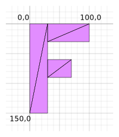

Title: WebGPU Translation
Description: Moving an object
TOC: Translation

This article assumes you've read [the article on fundamentals](webgpu-fundamentals.html),
[the article uniforms](webgpu-uniforms.html) and 
[the article on vertex-buffers](webgpu-vertex-buffers.html).
If you have not read them I suggest you read them first, then come back.

This article is the first of series of articles that will hopefully teach
you about 3D math. Each one builds on the previous lesson so you may find
them easiest to understand by reading them in order.

1. [Translation](webgpu-translation.html)  ⬅ you are here
2. [Rotation](webgpu-rotation.html)
3. [Scaling](webgpu-scale.html)
4. [Matrix Math](webgpu-matrix-math.html)
5. [Orthographic Projection](webgpu-orthographic-projection.html)
6. [Perspective Projection](webgpu-perspective-projection.html)
7. [Cameras](webgpu-cameras.html)
8. [Matrix Stacks](webgpu-matrix-stacks.html)
9. [Scene Graphs](webgpu-scene-graphs.html)

We are going to start code similar to the examples from [the article on vertex-buffers](webgpu-vertex-buffers.html)
but instead of a bunch of circles we're going to draw a single F and we'll use an [index buffer](webgpu-vertex-buffers.html#a-index-buffers) to keep the data
smaller.

Let's work in pixel space instead of clip space, just like the [Canvas 2D API](https://developer.mozilla.org/en-US/docs/Web/API/CanvasRenderingContext2D)
We'll make an F and we'll build it from 6 triangles like this

<div class="webgpu_center"></div>

Here's the data for the F

```js
function createFVertices() {
  const vertexData = new Float32Array([
    // left column
    0, 0,
    30, 0,
    0, 150,
    30, 150,

    // top rung
    30, 0,
    100, 0,
    30, 30,
    100, 30,

    // middle rung
    30, 60,
    70, 60,
    30, 90,
    70, 90,
  ]);

  const indexData = new Uint32Array([
    0,  1,  2,    2,  1,  3,  // left column
    4,  5,  6,    6,  5,  7,  // top run
    8,  9, 10,   10,  9, 11,  // middle run
  ]);

  return {
    vertexData,
    indexData,
    numVertices: indexData.length,
  };
}
```

The vertex data above is in pixel space so we need to translate that to clip space.
We can do that by passing the resolution into the shader and doing some math.
Here it is spelled out one step at a time.

```wgsl
struct Uniforms {
  color: vec4f,
  resolution: vec2f,
};

struct Vertex {
  @location(0) position: vec2f,
};

struct VSOutput {
  @builtin(position) position: vec4f,
};

@group(0) @binding(0) var<uniform> uni: Uniforms;

@vertex fn vs(vert: Vertex) -> VSOutput {
  var vsOut: VSOutput;
  
  let position = vert.position;

  // convert the position from pixels to a 0.0 to 1.0 value
  let zeroToOne = position / uni.resolution;

  // convert from 0 <-> 1 to 0 <-> 2
  let zeroToTwo = zeroToOne * 2.0;

  // covert from 0 <-> 2 to -1 <-> +1 (clip space)
  let flippedClipSpace = zeroToTwo - 1.0;

  // flip Y
  let clipSpace = flippedClipSpace * vec2f(1, -1);

  vsOut.position = vec4f(clipSpace, 0.0, 1.0);
  return vsOut;
}

@fragment fn fs(vsOut: VSOutput) -> @location(0) vec4f {
  return uni.color;
}
```

You can see we take a vertex position and divide it by the resolution. 
This gives us a value that goes from 0 to 1 across the canvas.
We then multiply by 2 to get a value that goes from 0 to 2 across the canvas.
We subtract 1. Now our value is in clip space but it's flipped because
the clip space goes positive Y up where as canvas 2d goes positive Y down.
So we multiply Y by -1 to flip it. Now we have our needed clip space value
which we can output from the shader.

We've only got one attribute so our pipeline looks like this

```js
  const pipeline = device.createRenderPipeline({
    label: 'just 2d position',
    layout: 'auto',
    vertex: {
      module,
      buffers: [
        {
*          arrayStride: (2) * 4, // (2) floats, 4 bytes each
*          attributes: [
*            {shaderLocation: 0, offset: 0, format: 'float32x2'},  // position
*          ],
        },
      ],
    },
    fragment: {
      module,
      targets: [{ format: presentationFormat }],
    },
  });
```

We need to setup a buffer for our uniforms

```js
  // color, resolution, padding
*  const uniformBufferSize = (4 + 2) * 4 + 8;
  const uniformBuffer = device.createBuffer({
    label: 'uniforms',
    size: uniformBufferSize,
    usage: GPUBufferUsage.UNIFORM | GPUBufferUsage.COPY_DST,
  });

  const uniformValues = new Float32Array(uniformBufferSize / 4);

  // offsets to the various uniform values in float32 indices
*  const kColorOffset = 0;
*  const kResolutionOffset = 4;
*
*  const colorValue = uniformValues.subarray(kColorOffset, kColorOffset + 4);
*  const resolutionValue = uniformValues.subarray(kResolutionOffset, kResolutionOffset + 2);
*
*  // The color will not change so let's set it once at init time
*  colorValue.set([Math.random(), Math.random(), Math.random(), 1]);
```

At render time we need to set the resolution

```js
  function render() {
    ...

    // Set the uniform values in our JavaScript side Float32Array
    resolutionValue.set([canvas.width, canvas.height]);

    // upload the uniform values to the uniform buffer
    device.queue.writeBuffer(uniformBuffer, 0, uniformValues);
```

Before we run it lets make the background of the canvas look like
graph paper. We'll set it's scale so each grid cell of the graph
paper is 10x10 pixels and every 100x100 pixels we'll draw a bolder
line.

```css
:root {
  --bg-color: #fff;
  --line-color-1: #AAA;
  --line-color-2: #DDD;
}
@media (prefers-color-scheme: dark) {
  :root {
    --bg-color: #000;
    --line-color-1: #666;
    --line-color-2: #333;
  }
}
canvas {
  display: block;  /* make the canvas act like a block   */
  width: 100%;     /* make the canvas fill its container */
  height: 100%;
  background-color: var(--bg-color);
  background-image: linear-gradient(var(--line-color-1) 1.5px, transparent 1.5px),
      linear-gradient(90deg, var(--line-color-1) 1.5px, transparent 1.5px),
      linear-gradient(var(--line-color-2) 1px, transparent 1px),
      linear-gradient(90deg, var(--line-color-2) 1px, transparent 1px);
  background-position: -1.5px -1.5px, -1.5px -1.5px, -1px -1px, -1px -1px;
  background-size: 100px 100px, 100px 100px, 10px 10px, 10px 10px;  
}
```

The CSS above should handle both light and dark cases.

All our examples to this point have used an opaque canvas. To make it transparent,
so we can see the background we just setup, we need to make a few changes.

First we need to set the `alphaMode` when we configure the canvas to `'premultiplied'`.
It defaults to `'opaque'`.

```js
  context.configure({
    device,
    format: presentationFormat,
+    alphaMode: 'premultiplied',
  });
```

Then we need to clear the canvas to 0, 0, 0, 0 in our `GPURenderPassDescriptor`.
Because the default `clearValue` is 0, 0, 0, 0 we can just delete the line that
was setting it to something else.

```js
  const renderPassDescriptor = {
    label: 'our basic canvas renderPass',
    colorAttachments: [
      {
        // view: <- to be filled out when we render
-        clearValue: [0.3, 0.3, 0.3, 1],
        loadOp: 'clear',
        storeOp: 'store',
      },
    ],
  };
```

And with that, here's our F

{{{example url="../webgpu-translation-prep.html"}}}

Notice the F's size relative to the grid behind it.
The vertex positions of the F data make an F that is 100 pixels
wide and 150 pixels tall and that matches what we displayed.
The F starts at 0,0 and extends right to 100,0 and down to 0,150

Now that we have the basics in place, let's add *translation*.

Translation is just the process of moving things so all we need
to do is add translation to our uniforms and add that to our
position

```wgsl
struct Uniforms {
  color: vec4f,
  resolution: vec2f,
+  translation: vec2f,
};

struct Vertex {
  @location(0) position: vec2f,
};

struct VSOutput {
  @builtin(position) position: vec4f,
};

@group(0) @binding(0) var<uniform> uni: Uniforms;

@vertex fn vs(vert: Vertex) -> VSOutput {
  var vsOut: VSOutput;
  
+  // Add in the translation
-  let position = vert.position;
+  let position = vert.position + uni.translation;

  // convert the position from pixels to a 0.0 to 1.0 value
  let zeroToOne = position / uni.resolution;

  // convert from 0 <-> 1 to 0 <-> 2
  let zeroToTwo = zeroToOne * 2.0;

  // covert from 0 <-> 2 to -1 <-> +1 (clip space)
  let flippedClipSpace = zeroToTwo - 1.0;

  // flip Y
  let clipSpace = flippedClipSpace * vec2f(1, -1);

  vsOut.position = vec4f(clipSpace, 0.0, 1.0);
  return vsOut;
}

@fragment fn fs(vsOut: VSOutput) -> @location(0) vec4f {
  return uni.color;
}
```

We need to add room to our uniform buffer

```js
-  // color, resolution, padding
-  const uniformBufferSize = (4 + 2) * 4 + 8;
+  // color, resolution, translation
+  const uniformBufferSize = (4 + 2 + 2) * 4;
  const uniformBuffer = device.createBuffer({
    label: 'uniforms',
    size: uniformBufferSize,
    usage: GPUBufferUsage.UNIFORM | GPUBufferUsage.COPY_DST,
  });

  const uniformValues = new Float32Array(uniformBufferSize / 4);

  // offsets to the various uniform values in float32 indices
  const kColorOffset = 0;
  const kResolutionOffset = 4;
+  const kTranslationOffset = 6;

  const colorValue = uniformValues.subarray(kColorOffset, kColorOffset + 4);
  const resolutionValue = uniformValues.subarray(kResolutionOffset, kResolutionOffset + 2);
+  const translationValue = uniformValues.subarray(kTranslationOffset, kTranslationOffset + 2);
```

And then we need to set a translation at render time

```js
+  const settings = {
+    translation: [0, 0],
+  };

  function render() {
    ...

    // Set the uniform values in our JavaScript side Float32Array
    resolutionValue.set([canvas.width, canvas.height]);
+    translationValue.set(settings.translation);

    // upload the uniform values to the uniform buffer
    device.queue.writeBuffer(uniformBuffer, 0, uniformValues);
```

Finally let's add a UI so we can adjust the translation

```js
+import GUI from '../3rdparty/muigui-0.x.module.js';

...
  const settings = {
    translation: [0, 0],
  };

+  const gui = new GUI();
+  gui.onChange(render);
+  gui.add(settings.translation, '0', 0, 1000).name('translation.x');
+  gui.add(settings.translation, '1', 0, 1000).name('translation.y');
```

And now we've added translation

{{{example url="../webgpu-translation.html"}}}

Notice it matches our pixel grid. If we set the translation to 200,300 the F
is drawn with its 0,0 top left vertex at 200,300.

This article might have seemed exceedingly simple. We were already using *translation*
in several examples already though we named it 'offset'.
This article is part of series. Though it was simple, hopefully its point will make
sense in context as we continue the series.

Next up is [rotation](webgpu-rotation.html).
